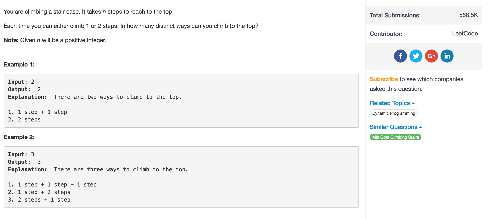

# Climbing Stairs



## Idea

1. 想我是怎么走到第n阶梯的
   1. 走一步到的
   2. 走两步到的

      所以 ways\[n\] = ways\[n-1\] + ways\[n-2\]
2. 注意

    判读CC，n &lt; 2, 直接return n

    要init ways\[0\], ways\[1\], ways\[2\]

## Code

```text
 public int climbStairs(int n) {
    //介于MatrixDP 和 SequenceDP 之间的一道题
    // create an extra space to store the ways
    if (n < 2) {
        return n;
    }
    int[] ways = new int[n+1];

    //*initialize 易错处
    ways[0] = 0;
    ways[1] = 1;
    ways[2] = 2;
    // 1 step at a time
    for (int i = 3; i <= n; i++) {
        ways[i] = ways[i-1] + ways[i-2];
    }
    return ways[n];
}
```

## Ref

1. [LeetCode Climbing Stairs 递归求解和动态规划法](http://blog.csdn.net/kenden23/article/details/17377869)

