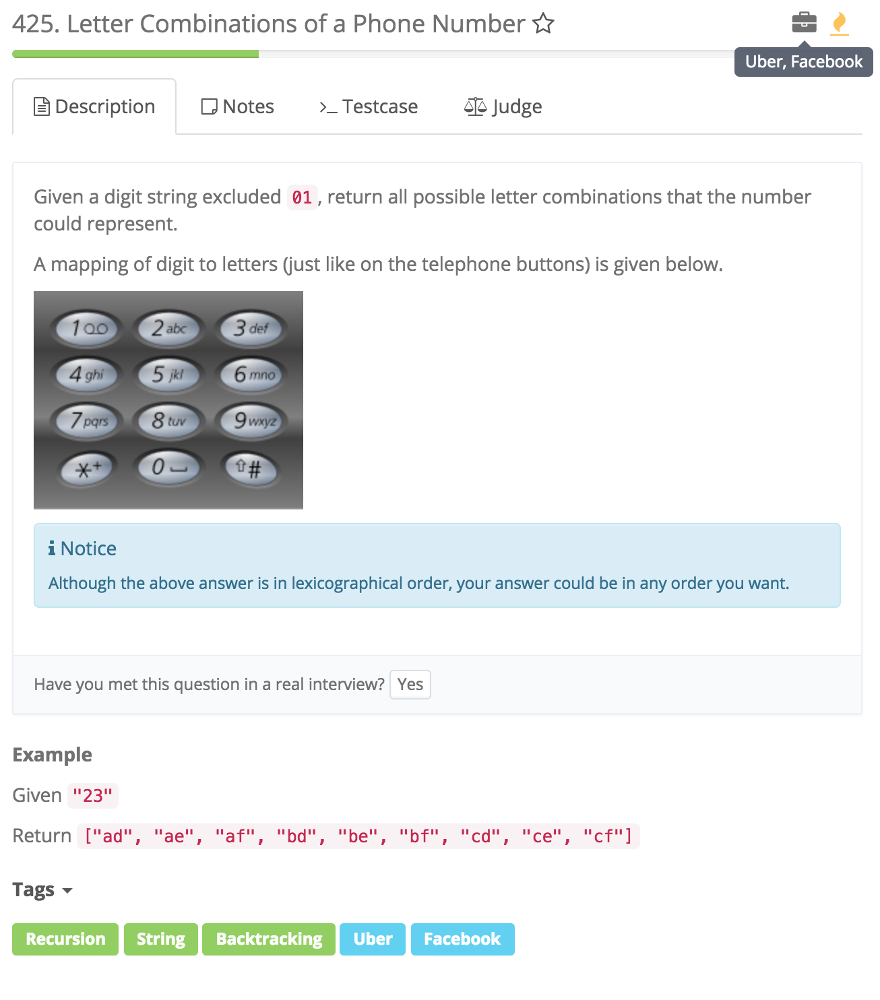

# Backtracking



## Idea:

1. 用HashMap存放映射，
2. 用backtracking模板找出所有可能的组合

   **Error:**

## Code

```text
public List<String> letterCombinations(String digits) {

        // mapping of digits to letters
        HashMap<Character, char[]> map = new HashMap<Character, char[]>();
        map.put('0', new char[] {});
        map.put('1', new char[] {});
        map.put('2', new char[] { 'a', 'b', 'c' });
        map.put('3', new char[] { 'd', 'e', 'f' });
        map.put('4', new char[] { 'g', 'h', 'i' });
        map.put('5', new char[] { 'j', 'k', 'l' });
        map.put('6', new char[] { 'm', 'n', 'o' });
        map.put('7', new char[] { 'p', 'q', 'r', 's' });
        map.put('8', new char[] { 't', 'u', 'v'});
        map.put('9', new char[] { 'w', 'x', 'y', 'z' });

        ArrayList<String> res = new ArrayList<String>();
        //CC
        if(digits.equals("") || digits == null){ /*equals not digits.length == 0 /code/Solution.java:23: error: cannot find symbolif(digits.length == 0 || digits == null){*/
            return res; 
        }

        StringBuilder temp = new StringBuilder();//**
        backTracking(digits, map, res, temp);
        return res;
    }    


        //backtracking template
    private void backTracking (String digits, HashMap<Character, char[]> map, ArrayList<String> res, StringBuilder temp){ //**
            //temp的长度与digits一样时加入res中
            if(temp.length() == digits.length()){
                res.add(temp.toString()); //** temp 是sb，要转成String
                return;//**
            }

            for(char c : map.get(digits.charAt(temp.length()))){ // char c

                    //根据
                    temp.append(c);
                    backTracking(digits, map, res, temp);
                    temp.deleteCharAt(temp.length()-1); //StringBuiler 的用法 deleteCharAt
            }


    }
```

