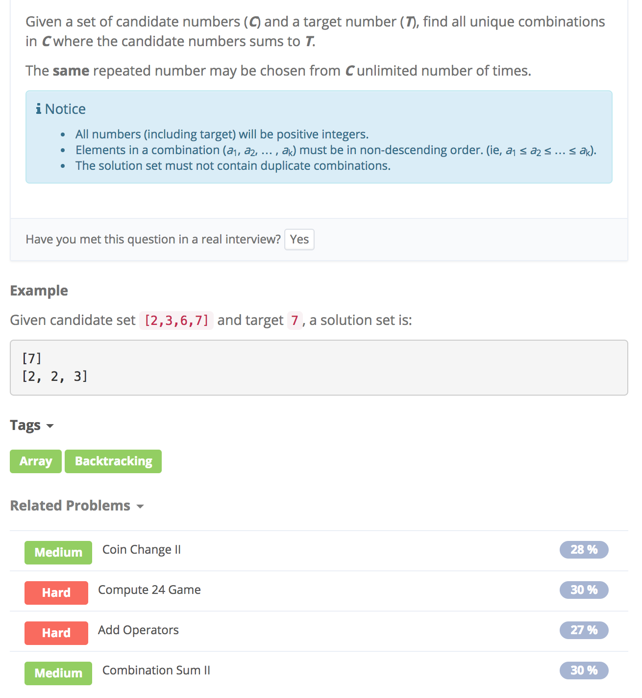

# Combinations Sum



## Assumption

1. Given a set of candidate numbers \(C\) and a target number \(T\), find **all unique combinations** in C where the candidate numbers sums to T.
2. The same repeated number may be chosen from C unlimited number of times.

## idea

1. backtracking 模板
2. 注意target - candidates\[i\]
3. 退出条件target == 0
4. 允许重复，所以helper中start还是i

## Code

```text
public static List<List<>> combinationSum(int[] candidates, int target){
        List<List<Integer>> result = new ArrayList<>();
        List<Integer> temp = new ArrayList<>();
        //用减法就不用定义一个int sum; 需要先判断当前nums[i]是否大于target，如果是就直接break，后面的就不用再找了。不是的话就target-candidates[i]
        if(candidates == null || candidates.length == 0){
            return result;
        }
        //*sort candidates
        Arrays.sort(candidates);
        helper(candidates, target, 0, result, temp);
        return result;
    }

    private static void helper(int[] candidates, int target, int start, List<List<Integer>> result, List<Integer> temp){
        //退出条件
        if(target == 0){
            result.add(new ArrayList<>(temp));
            return;
        }

        for(int i = start; i < candidates.length; i++){
            if(candidates[i] > target){
                break;
            }
            else{
                temp.add(candidates[i]);
                helper(candidates, target-candidates[i], i, result, temp); //*许重复
                temp.remove(temp.size()-1);
            }
        }
    }
```

