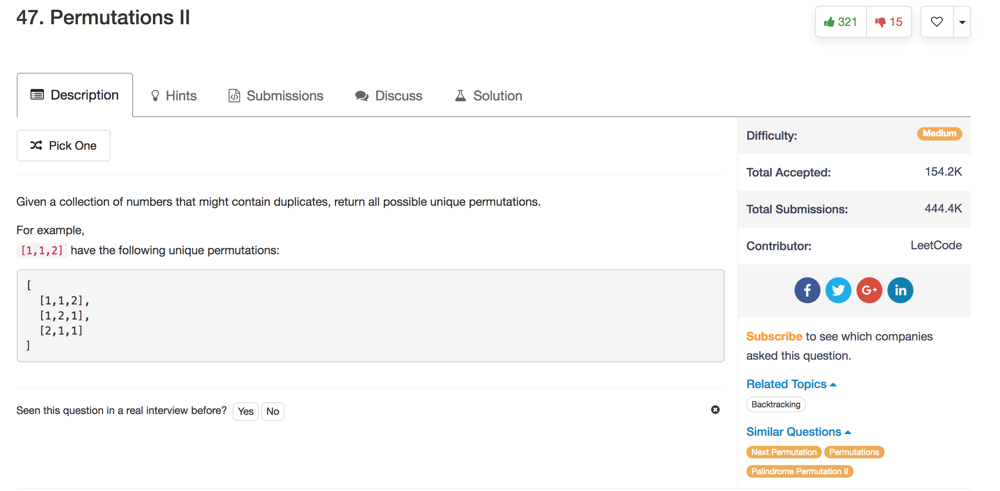

# permutations II



## Analysis

给你一个list，有重复element，要求找出所有对这些element的unique排序。用一个List&lt;List&lt;Integer&gt;&gt; result 存放排序，

## Idea

1. 要解决用过的元素就跳过： 用boolean\[\]来记录该元素是否被用过
2. 不能有重复的组合：

## code

```text
public class Solution {
    public List<List<Integer>> permuteUnique(int[] nums) {
        List<List<Integer>> res = new ArrayList<List<Integer>>();
        if(nums==null || nums.length==0) return res;
        boolean[] used = new boolean[nums.length];
        List<Integer> list = new ArrayList<Integer>();
        Arrays.sort(nums);
        dfs(nums, used, list, res);
        return res;
    }

    public void dfs(int[] nums, boolean[] used, List<Integer> list, List<List<Integer>> res){
        if(list.size()==nums.length){
            res.add(new ArrayList<Integer>(list));
            return;
        }
        for(int i=0;i<nums.length;i++){
            if(used[i]) continue;
            if(i>0 &&nums[i-1]==nums[i] && !used[i-1]) continue;
            used[i]=true;
            list.add(nums[i]);
            dfs(nums,used,list,res);
            used[i]=false;
            list.remove(list.size()-1);
        }
    }
}
```

