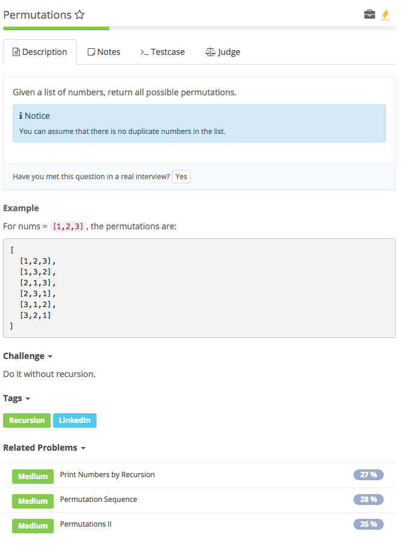

# permutations



## Analysis

### Idea:

1. Backtracking
2. 若temp中已有当前元素就continue跳过

```text
public class Solution {
    public List<List<Integer>> permute(int[] nums) {
    List<List<Integer>> list = new ArrayList<>();
    permuter(list, new ArrayList<>(), nums);
    return list;
    }

    private void permuter(List<List<Integer>> list, List<Integer> templist, int[] nums){
        if(templist.size() == nums.length){ //*
            list.add(new ArrayList<>(templist));    
        }else{ //*
            for(int i = 0; i < nums.length; i++ ){
                if (templist.contains(nums[i])) continue; //*
                templist.add(nums[i]);
                permuter(list, templist, nums);
                templist.remove(templist.size() - 1);
            }
        }
    }
}
```

#### Syntax

1. ArrayList.size\(\)
2. ArrayList.contains\(ele\)
3. ArrayList.add\(ele\)

