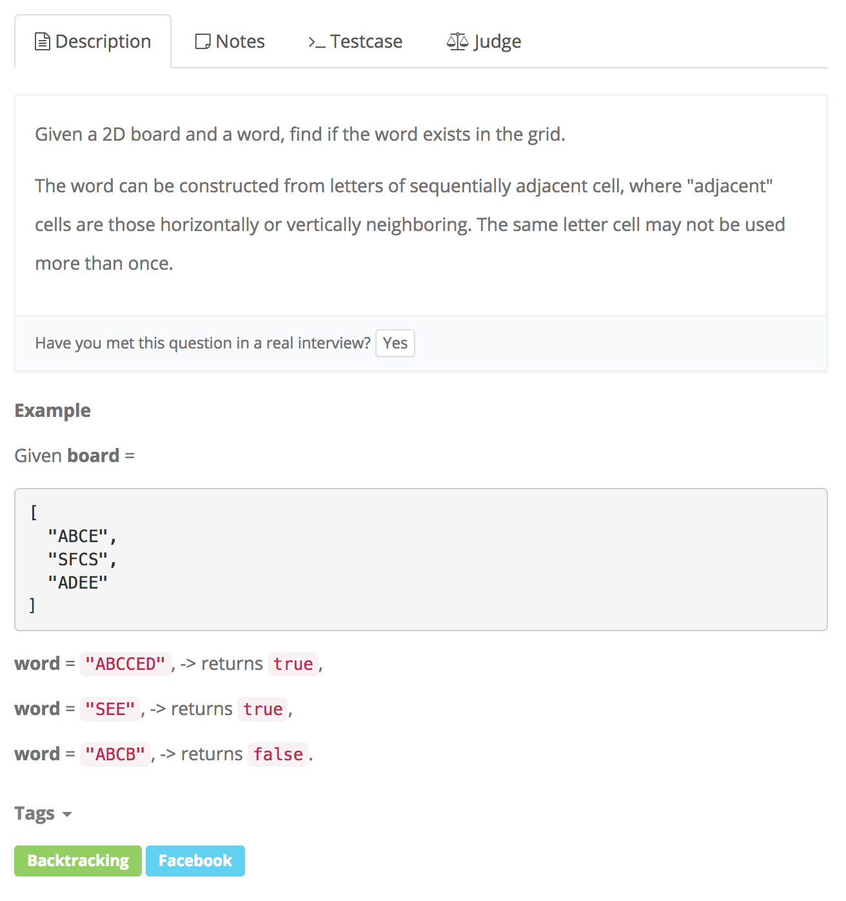

# word search



## Idea

1. Backtracking 的方法来解决这道题目。我们需要先从board中找到第一个字符出现的位置，然后从这个位置开始往上，下，左，右开始寻找；这里我们要借助一个exist\(board, i, j, word, index\)的函数来寻找； 1. 当index==word.length的时候就找到了对应的字符，返回true; **注意边界条件的check**，i, j要保证在board内，或者当board\[i\]\[j\]!=word.charAt\(index\)的时候都返回false。 2. 访问过的字符标记为\*，得到结果后再还原为字符，继续寻找
2. 复杂度： Time复杂度: 遍历整个m  _n 的board的时间复杂度为m_  n,对于每个点都会往上下左右来遍历寻找， k为word长度，大概要遍历4^k次，所以总的时间复杂度大概在mn4^k. Space： 由于word长度为k，recursive space大概在O\(k\).

## Code

```text
public boolean exist(char[][] board, String word) {
    for(int i = 0; i < board.length; i++)
        for(int j = 0; j < board[0].length; j++){
            if(exist(board, i, j, word, 0))
                return true;
        }
    return false;
}
private boolean exist(char[][] board, int i, int j, String word, int index){
    if(index == word.length()) return true;
    if(i > board.length-1 || i <0 || j<0 || j >board[0].length-1 || board[i][j]!=word.charAt(ind))
        return false;
    board[i][j]='*'; //*
    boolean result =    exist(board, i-1, j, word, index+1) ||
                        exist(board, i, j-1, word, index+1) ||
                        exist(board, i, j+1, word, index+1) ||
                        exist(board, i+1, j, word, index+1);
    board[i][j] = word.charAt(index); //*
    return result;
}
```

