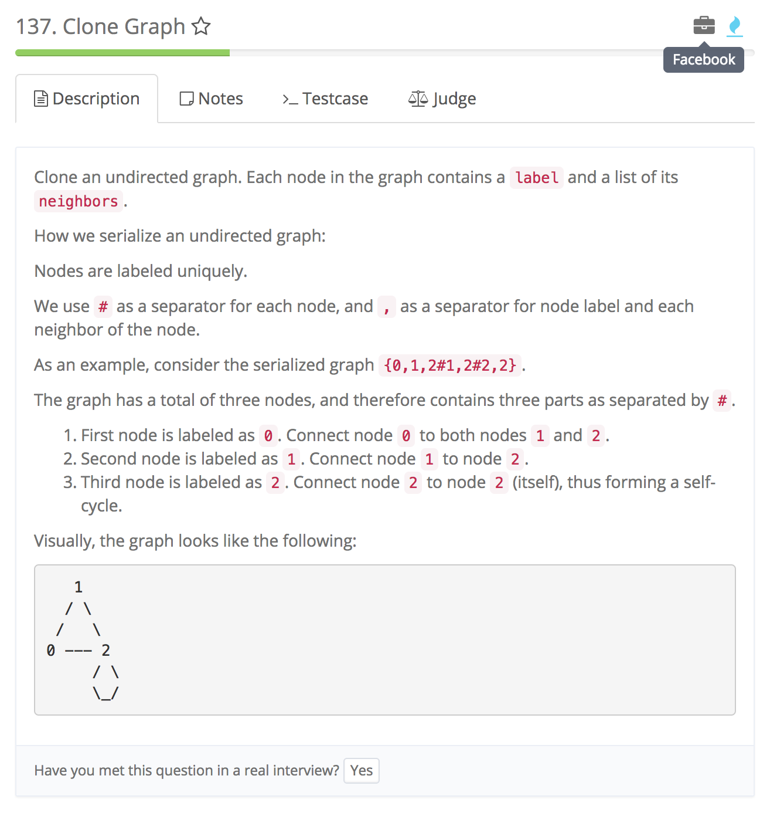
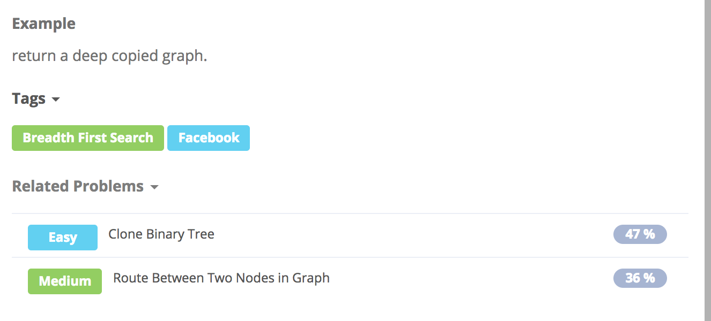

# Clone Graph

  


## Idea

DFS

1. HashMap 存放cloned nodes
2. 递归调用clone函数去clone node

```text
/**
 * Definition for undirected graph.
 * class UndirectedGraphNode {
 *     int label;
 *     List<UndirectedGraphNode> neighbors;
 *     UndirectedGraphNode(int x) { label = x; neighbors = new ArrayList<UndirectedGraphNode>(); }
 * };
 */
public class Solution {
    // store cloned nodes
    private HashMap<Integer, UndirectedGraphNode> map = new HashMap<>();
    public UndirectedGraphNode cloneGraph(UndirectedGraphNode node) {
        // call clone funct
        return clone(node);
    }

    private UndirectedGraphNode clone(UndirectedGraphNode node) {
        //CC node is null return null
        if(node == null) return null;

        //check if it is cloned, if so return it
        if(map.containsKey(node.label)) {
            return map.get(node.label);
        }
        //if not, clone it, put it into map and add its neighbours
        UndirectedGraphNode clone = new UndirectedGraphNode(node.label);
        map.put(clone.label, clone);
        for(UndirectedGraphNode neighbor : node.neighbors) {
            clone.neighbors.add(clone(neighbor)); // check if we cloned its neighbor, if so return neighbors, if not clone it
        }
        return clone;
    }
}
```

