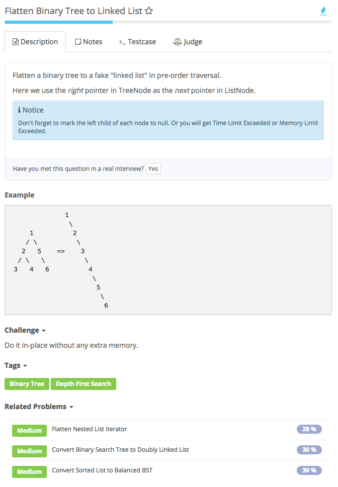

# flatten binary tree to linked list



## Analysis

### Idea：

1. 用Divide & Conquer实现该BT的Preorder traversal
2. 用right pointer 当做linkedlist中的next pointer

   【复习preorder的三种实现模板，见算法文件】

```text
// Version 1: Traverse
public class Solution {
    private TreeNode lastNode = null;

    public void flatten(TreeNode root) {
        if (root == null) {
            return;
        }

        if (lastNode != null) {
            lastNode.left = null;
            lastNode.right = root;
        }

        lastNode = root;
        TreeNode right = root.right;
        flatten(root.left);
        flatten(right);
    }
}

// version 2: Divide & Conquer
public class Solution {
    /**
     * @param root: a TreeNode, the root of the binary tree
     * @return: nothing
     */
    public void flatten(TreeNode root) {
        helper(root);
    }

    // flatten root and return the last node
    private TreeNode helper(TreeNode root) {
        if (root == null) {
            return null;
        }

        TreeNode leftLast = helper(root.left);
        TreeNode rightLast = helper(root.right);

        // connect leftLast to root.right
        if (leftLast != null) {
            leftLast.right = root.right;
            root.right = root.left;
            root.left = null;
        }

        if (rightLast != null) {
            return rightLast;
        }

        if (leftLast != null) {
            return leftLast;
        }

        return root;
    }
}

// version 3: Non-Recursion
/**
 * Definition of TreeNode:
 * public class TreeNode {
 *     public int val;
 *     public TreeNode left, right;
 *     public TreeNode(int val) {
 *         this.val = val;
 *         this.left = this.right = null;
 *     }
 * }
 */
public class Solution {
    /**
     * @param root: a TreeNode, the root of the binary tree
     * @return: nothing
     */
    public void flatten(TreeNode root) {
        if (root == null) {
            return;
        }

        Stack<TreeNode> stack = new Stack<>();
        stack.push(root);

        while (!stack.empty()) {
            TreeNode node = stack.pop();
            if (node.right != null) {
                stack.push(node.right);
            }
            if (node.left != null) {
                stack.push(node.left);
            }

            // connect 
            node.left = null;
            if (stack.empty()) {
                node.right = null;
            } else {
                node.right = stack.peek();
            }
        }
    }
}
```

