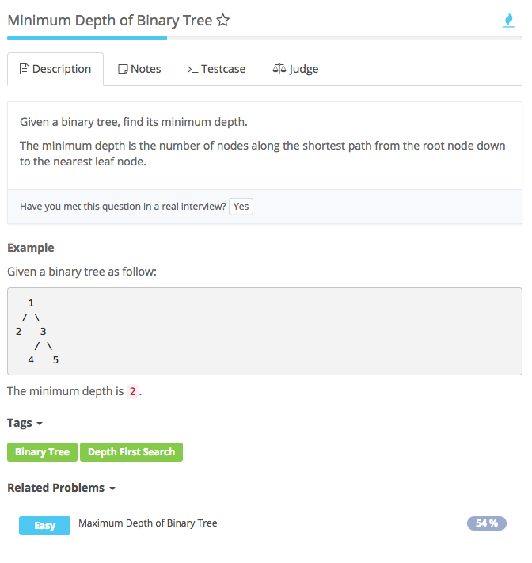

# minimum depth of binary tree



```text
public class Solution {
    public int minDepth(TreeNode root) {
        if (root == null) {
            return 0;
        }
        return getMin(root);
    }

    public int getMin(TreeNode root){
        if (root == null) {
            return Integer.MAX_VALUE;
        }

        if (root.left == null && root.right == null) {
            return 1;
        }

        return Math.min(getMin(root.left), getMin(root.right)) + 1;
    }
}
```

