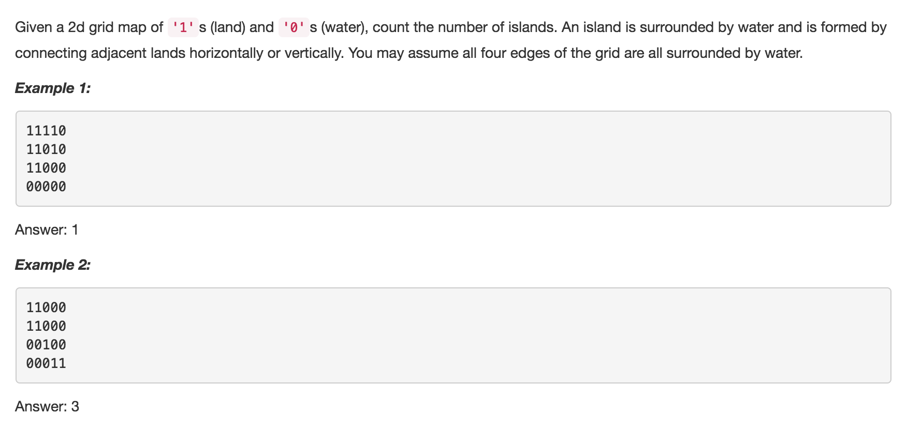
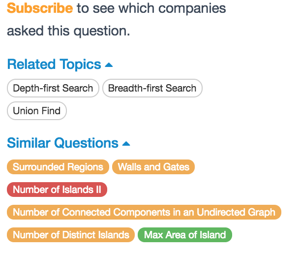

# Number of Islands

 

## Idea

### DFS

1. count the number of island
2. mark all the points of the visited island to 0

```text
private int n;
private int m;

public int numIslands(char[][] grid) {
    int count = 0;
    n = grid.length;
    if (n == 0) return 0;
    m = grid[0].length;
    for (int i = 0; i < n; i++){
        for (int j = 0; j < m; j++)
            if (grid[i][j] == '1') {
                DFSMarking(grid, i, j);
                ++count;  //*
            }
    }    
    return count;
}

public static void islandMark(char[][] grid, int i, int j) {
    if(i >= 0 && i < grid.length &&j >= 0 && j < grid[0].length && grid[i][j] == '1') {
        //set visited point to 0
        grid[i][j] = '0';
        //visit the whole island
        islandMark(grid, i-1, j);
        islandMark(grid, i+1, j);
        islandMark(grid, i, j-1);
        islandMark(grid, i, j+1);
    }
    return;
}
```

