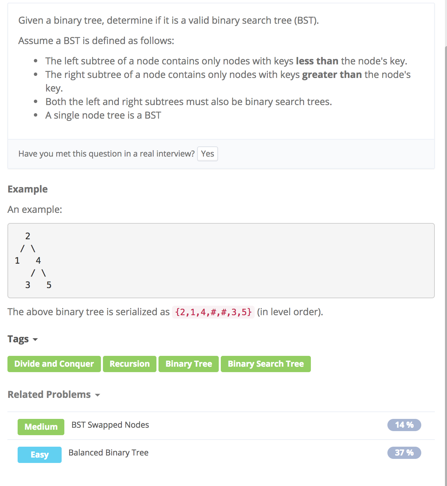

# Valid Binary Search Tree



## Idea1:

递归调用；用一个函数判断当前数是否小于和大于相应的值

```text
public class Solution {
    public boolean isValidBST(TreeNode root) {
        return isValidBST(root, Long.MIN_VALUE, Long.MAX_VALUE);
    }

    public boolean isValidBST(TreeNode root, long minVal, long maxVal) {
        if (root == null) return true;
        if (root.val >= maxVal || root.val <= minVal) return false;
        return isValidBST(root.left, minVal, root.val) && isValidBST(root.right, root.val, maxVal);
    }
}
```

## Idea2

\[用stack的模板\]\([https://leetcode.com/problems/validate-binary-search-tree/discuss/32112/Learn-one-iterative-inorder-traversal-apply-it-to-multiple-tree-questions-\(Java-Solution\)/115372?page=1](https://leetcode.com/problems/validate-binary-search-tree/discuss/32112/Learn-one-iterative-inorder-traversal-apply-it-to-multiple-tree-questions-%28Java-Solution%29/115372?page=1)\)

```text
public boolean isValidBST(TreeNode root) {
   if (root == null) return true;
   Stack<TreeNode> stack = new Stack<>();
   TreeNode pre = null;
   while (root != null || !stack.isEmpty()) {
      while (root != null) {
         stack.push(root);
         root = root.left;
      }
      root = stack.pop();
      if(pre != null && root.val <= pre.val) return false; //*
      pre = root;
      root = root.right;
   }
   return true;
}
```

