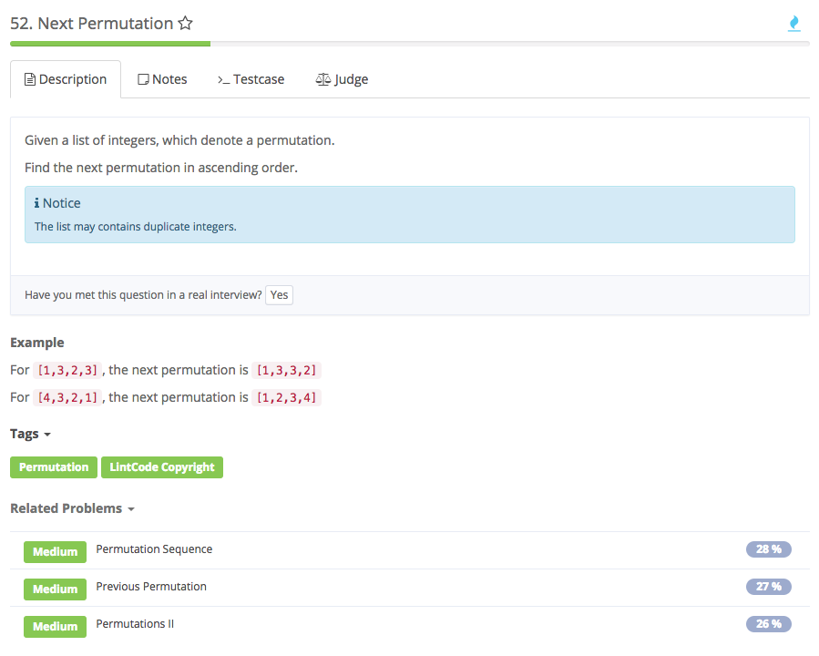

# Next permutation



## Idea

1. 初始化index=-1，i标记从后往前找到的第一个比i-1大的元素，用index=i存放。然后再从后往前到i，**找第一个比nums\[last\]大的数**，标记为bigger，交换nums\[last\]和nums\[bigger\]后，再把从last+1到nums.length-1的元素Reverse。
2. 如果一直没有找到这个i，index仍是-1，证明nums是descending, 所以直接Reverse整个nums
3. 需要定义个Reverse和swap函数

## Error：

1. i标记从后往前找到的第一个比i-1大的元素，交换i和i-1后，再把从i到nums.length-1的元素Reverse。

    log： input：\[1,3,2\] output: \[3,2,1\] expect: \[2,1,3\]

    原因：要和第一个比nums\[i\]小的数交换，不是简单的和前一个

   **Code**

```text
public nextPermutation(int[] num) {
        // find the last increase index
        int index = -1; //一定要在for外初始化，若在for中，for结束后，index就无效了
        for (int i = num.length - 2; i >= 0; i--) {
            if (num[i] < num[i + 1]) {
                index = i;
                break;
            }
        }
        if (index == -1) {
            reverse(num, 0, num.length - 1);
            return num;
        }

        // find the first bigger one
        int biggerIndex = index + 1; //*
        for (int i = num.length - 1; i > index; i--) {
            if (num[i] > num[index]) {
                biggerIndex = i;
                break;
            }
        }

        // swap them to make the permutation bigger
        swap(nums, last, bigger);

        // reverse the last part
        reverse(num, last + 1, num.length - 1);
    }
public void swap(int[] nums, int i, int j){
        int temp = nums[i];
        nums[i] = nums[j];
        nums[j] = temp;
    }
public void reverse(int[] num, int start, int end) {
        for (int i = start, j = end; i < j; i++, j--) {
            int temp = num[i];
            num[i] = num[j];
            num[j] = temp;
        }
    }
```

## 重点

1. 变量初始化的位置，注意scope
2. Reverse函数中for loop中的技巧，i&lt;j, i++, j--

