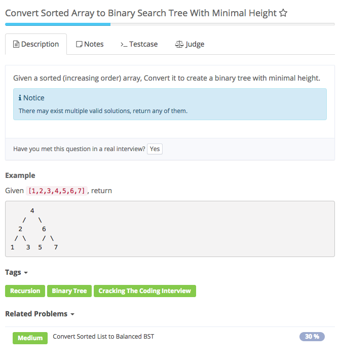
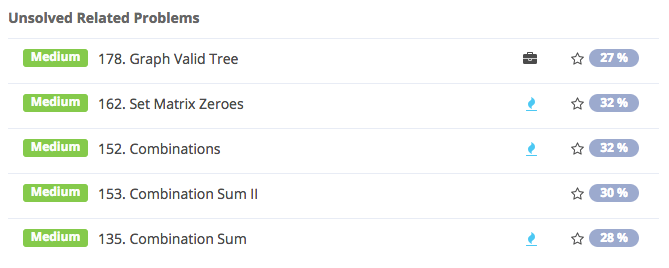

# convert sorted array to binary search tree with minimal height



## Analysis

### Idea:

1. 递归地建立树，就是编写一个函数能创建root，root.left, root.right.然后不断地调用这个函数，直到某个条件
2. 这道题是找Mid作为root
3. 二分查找树的题目，要把一个有序数组转换成一颗二分查找树。其实从本质来看，如果把一个数组看成一棵树（也就是以中点为根，左右为左右子树，依次下去）数组就等价于一个二分查找树。所以如果要构造这棵树，那就是把中间元素转化为根，然后递归构造左右子树。所以我们还是用二叉树递归的方法来实现，以根作为返回值，每层递归函数取中间元素，作为当前根和赋上结点值，然后左右结点接上左右区间的递归函数返回值。时间复杂度还是一次树遍历O\(n\)，总的空间复杂度是栈空间O\(logn\)加上结果的空间O\(n\)，额外空间是O\(logn\)，总体是O\(n\)。

```text
/**
 * Definition of TreeNode:
 * public class TreeNode {
 *     public int val;
 *     public TreeNode left, right;
 *     public TreeNode(int val) {
 *         this.val = val;
 *         this.left = this.right = null;
 *     }
 * }
 */ 
public class Solution {
    /**
     * @param A: an integer array
     * @return: a tree node
     */
    public TreeNode sortedArrayToBST(int[] A) {  
        // write your code here
        if(A == null || A.length == 0) {
            return null;
        }
        return helper (A, 0, A.length - 1);
    }
    public TreeNode helper(int[] A, int left, int right) {
        if (left > right) { //和BS模板一样，左右指针相遇
            return null;
        }
        int m = (left + right) / 2;
        TreeNode root = new TreeNode(A[m]);
        root.left = helper(A, left, m - 1); //m-1
        root.right = helper(A, m + 1, right);
        return root;
    }
}
```



