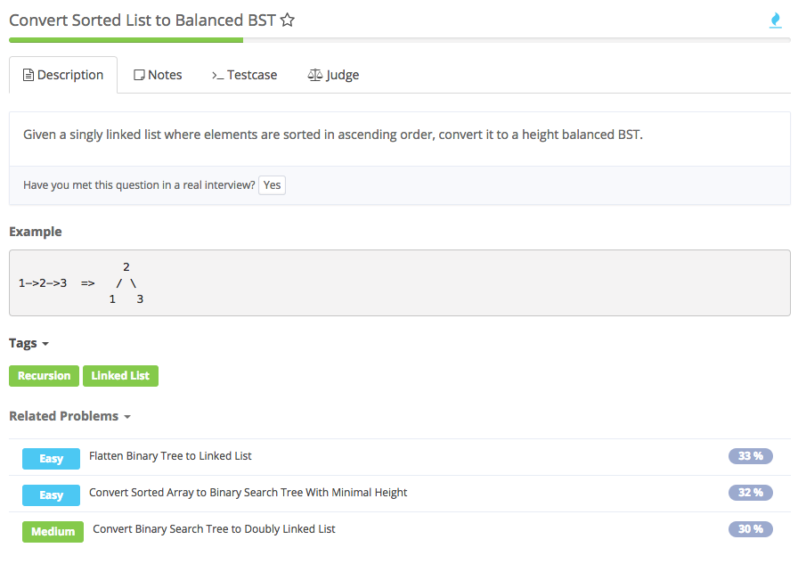
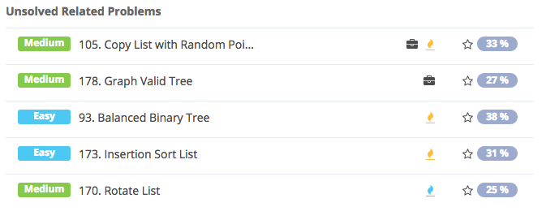

# convert sorted list to balanced BST



## Analysis

### Idea1:

1. height balanced BST:意味着 root.left height = root.right height; left child and right child are balanced
2. 考虑list元素个数是奇数和偶数的情况
3. 计算链表长度，以后每次递归到中间节点，用中间节点建根（偶数时，取前一个），递归下去建树。
4. 这个题是二分查找树的题目，要把一个有序链表转换成一棵二分查找树。其实原理还是跟Convert Sorted Array to Binary Search Tree这道题相似，我们需要取中点作为当前函数的根。这里的问题是对于一个链表我们是不能常量时间访问它的中间元素的。这时候就要利用到树的中序遍历了，按照递归中序遍历的顺序对链表结点一个个进行访问，而我们要构造的二分查找树正是按照链表的顺序来的。思路就是先对左子树进行递归，然后将当前结点作为根，迭代到下一个链表结点，最后在递归求出右子树即可。整体过程就是一次中序遍历，时间复杂度是O\(n\)，空间复杂度是栈空间O\(logn\)。

```text
/**
 * Definition for ListNode.
 * public class ListNode {
 *     int val;
 *     ListNode next;
 *     ListNode(int val) {
 *         this.val = val;
 *         this.next = null;
 *     }
 * }
 * Definition of TreeNode:
 * public class TreeNode {
 *     public int val;
 *     public TreeNode left, right;
 *     public TreeNode(int val) {
 *         this.val = val;
 *         this.left = this.right = null;
 *     }
 * }
 */ 
public class Solution {
    /**
     * @param head: The first node of linked list.
     * @return: a tree node
     */
    private ListNode current;
    private int getListLength(ListNode head) {
        int size = 0;
        // 最经常用的求list长度的办法
        while (head != null) {
            size++;
            head = head.next;
        }
        return size;
    }
    public TreeNode sortedListToBST(ListNode head) {  
        int size;
        current = head; //?????
        // 调用求list长度函数
        size = getListLength(head);
        // 调用构造树的递归函数
        return sortedListToBSTHelper(size);
    }
    // define recursion function
    private TreeNode sortedListToBSTHelper (int size) {  //???? 什么时候用private 什么时候用public
        if (size <= 0) {
            return null;
        }
        TreeNode left = sortedListToBSTHelper(size / 2); // 不要忘记TreeNode
        TreeNode root = new TreeNode(current.val);
        current = current.next; // 不是很懂current是怎么变换的
        TreeNode right = sortedListToBSTHelper(size - 1 - size / 2);
        root.left = left;
        root.right = right;
        return root;
    }
}
```

### Idea2:

1. 用快慢指针找到中点作为root，左半边recursively调用函数作为root.left
2. toBST中用tail来看是否到尾，就不用fast != null && fast.next != null\(fast.next 不能为null，不然fast.next.next就会出错\)
3. ListNode是linkedlist的，TreeNode是BST的

   ```text
   public TreeNode sortedListToBST(ListNode head) {
    if(head==null) return null; //return null, toBST中的也要判断CC
    return toBST(head,null);
   }
   public TreeNode toBST(ListNode head, ListNode tail){
    ListNode slow = head;
    ListNode fast = head;
    if(head==tail) return null; 

    while(fast!=tail&&fast.next!=tail){ //fast.next不能为null，否则fast.next.next出错
        fast = fast.next.next;
        slow = slow.next;
    }
    TreeNode thead = new TreeNode(slow.val);
    thead.left = toBST(head,slow);
    thead.right = toBST(slow.next,tail); //*
    return thead;
   }
   ```



