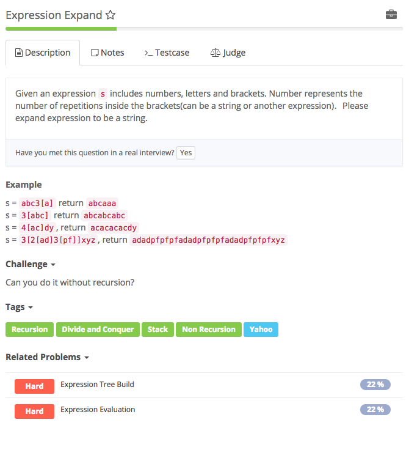

# @expression expand

## Analysis

### Idea:

想到stack并不难，这种嵌套式一般是DFS的思想，先走到最里面最小的那个括号，然后逐渐回到上一层→上一层。又∵非递归，“BFS queue， DFS stack”。想到用stack并不难 **Stack non-recursion DFS template\(要找出来\)** 要点是，处理完之后重新返回stack，才能够回到上一层操作 这个题具体操作起来真是很多可圈可点的地方，主要是在于String的处理上 1. reverse 因为stack的顺序，在这个题中需要每次将每层里的内容reverse。直接StringBuilder的reverse方法不可取：因为是reverse每一层。e.g. 3\[ab\]2\[c\]层直接从stack取出实际上是cc, abiabab将这个reverse后应该得到abababcc。这个时候考虑**逆向stack**\(如flatten nested list中用了两个stack\)，建立一个stack buffer，将stack pop出来的东西再reverse一个顺序，逆逆得顺 2. instanceof instanceof是一个很好用的操作符，a instanceof A,判断“一个对象是否是一个类的实例”。作为操作符instanceof不可以直接在最前面！取非（比如&gt;=这种也是），而是用 a instanceof A == false之类的判断 3. 复制StringBuilderadd到底append几次，怎么append：直接append add 是不可以的，因为add是在变的，必须要先将第一个add保存起来，类似于dummy node，预先保存queue size这种“锚定”。 4. 坑小心一点0\[peer\], -3\[aaa\]这种情况啊！

