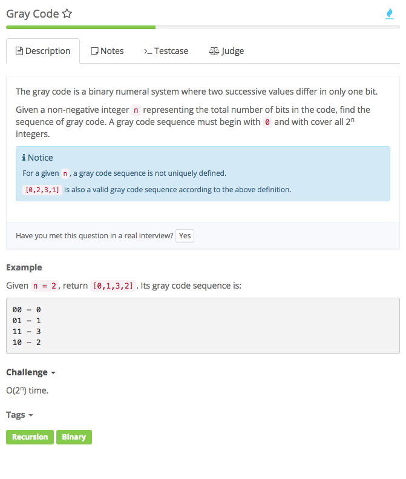

# gray code



## Analysis

### Idea:

1. 第一种方法：参考维基百科上关于格雷码的性质，有一条是说镜面排列的，n位元的格雷码可以从n-1位元的格雷码以上下镜射后加上新位元的方式快速的得到，如下图所示一般。

根据这条性质，求n位的gray code，可以根据n－1位的gray code来求。只要将n－1位的gray code的答案在前面加一位0以及n－1位的gray code的答案reverse之后全部在前面加一位1即可。 [更多其他的解法](http://www.cnblogs.com/grandyang/p/4315649.html)

```text
public class Solution {
    public ArrayList<Integer> grayCode(int n) {
        ArrayList<Integer> result = new ArrayList<Integer>();
        if (n <= 1) {
            for (int i = 0; i <= n; i++){
                result.add(i);
            }
            return result;
        }
        result = grayCode(n - 1);
        ArrayList<Integer> r1 = reverse(result);
        int x = 1 << (n-1);
        for (int i = 0; i < r1.size(); i++) {
            r1.set(i, r1.get(i) + x);
        }
        result.addAll(r1);
        return result;
    }

    public ArrayList<Integer> reverse (ArrayList<Integer> r) {
        ArrayList<Integer> rev = new ArrayList<Integer>();
        for (int i = r.size() - 1; i >= 0; i--) {
            rev.add(r.get(i));
        }
        return rev;
    }
}
```

