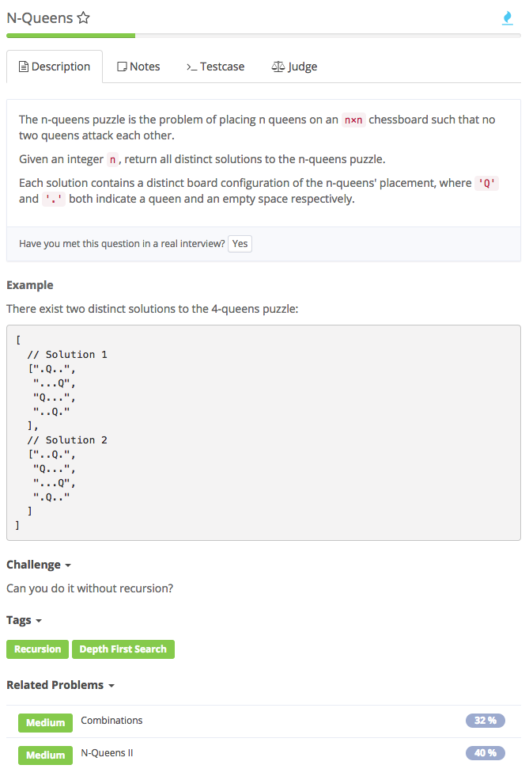

# N-queens



## Analysis

### Idea:

1. Recursion: 确定上一行Queen的位置，递归寻找下一行Queen的位置。寻找某一行Queen位置时，必须保证该行Queen占据的位置不和该行之前所有行的Queen有冲突，即不能在同一列，也不能在对角线。

```text
class Solution {
    /**
     * Get all distinct N-Queen solutions
     * @param n: The number of queens
     * @return: All distinct solutions
     * For example, A string '...Q' shows a queen on forth position
     */
    ArrayList<ArrayList<String>> solveNQueens(int n) {
        // write your code here
        ArrayList<ArrayList<String>> results = new ArrayList<>();
        if (n <= 0) {
            return results;
        }

        search(results, new ArrayList<Integer>(), n);
        return results;
    }

    /*
     * results store all of the chessboards
     * cols store the column indices for each row
     */
    private void search(ArrayList<ArrayList<String>> results,
                        ArrayList<Integer> cols,
                        int n) {
        if (cols.size() == n) {
            results.add(drawChessboard(cols));
            return;
        }

        for (int colIndex = 0; colIndex < n; colIndex++) {
            if (!isValid(cols, colIndex)) {
                continue;
            }
            cols.add(colIndex);
            search(results, cols, n);
            cols.remove(cols.size() - 1);
        }
    }

    private ArrayList<String> drawChessboard(ArrayList<Integer> cols) {
        ArrayList<String> chessboard = new ArrayList<>();
        for (int i = 0; i < cols.size(); i++) {
            StringBuilder sb = new StringBuilder();
            for (int j = 0; j < cols.size(); j++) {
                sb.append(j == cols.get(i) ? 'Q' : '.');
            }
            chessboard.add(sb.toString());
        }
        return chessboard;
    }

    private boolean isValid(ArrayList<Integer> cols, int column) {
        int row = cols.size();
        for (int rowIndex = 0; rowIndex < cols.size(); rowIndex++) {
            if (cols.get(rowIndex) == column) {
                return false;
            }
            if (rowIndex + cols.get(rowIndex) == row + column) {
                return false;
            }
            if (rowIndex - cols.get(rowIndex) == row - column) {
                return false;
            }
        }
        return true;
    }
};
```

### 知识点：

1. ArrayList

   2.StringBuilder sb.toString\(\)

