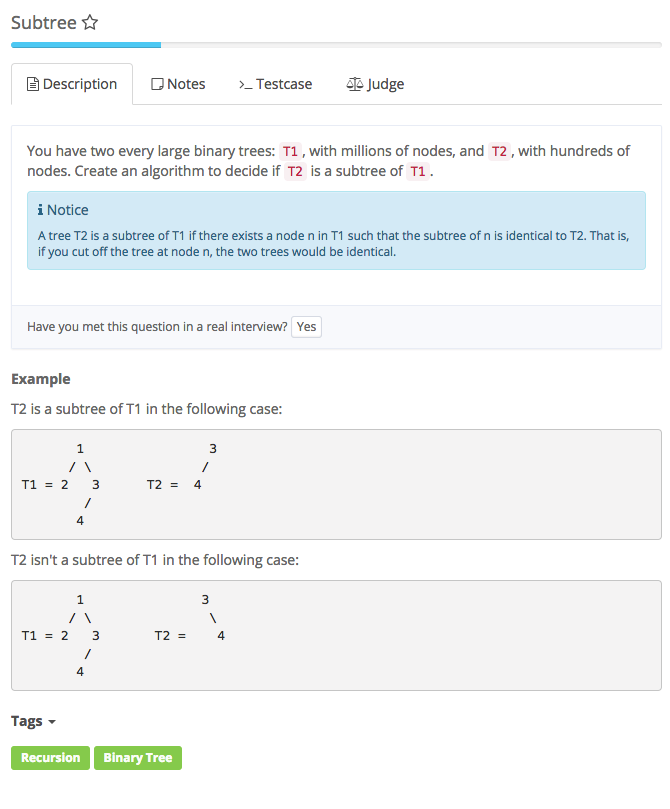
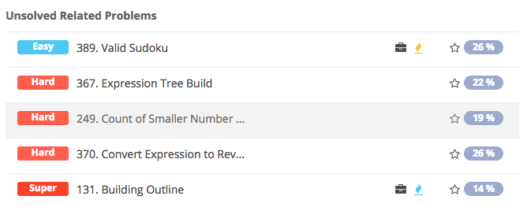

# subtree



## Analysis

### Idea:

1. 非递归版本：非递归版本用BFS遍历T1,找所有与T2值相等的点，作为备选节点。然后比较以这些节点为根的子树是否和T2等同。
2. 递归版本：先看T1和T2是否等同，若不等同，则递归看T1的左右子树是否和T2等同。

```text
/**
 * Definition of TreeNode:
 * public class TreeNode {
 *     public int val;
 *     public TreeNode left, right;
 *     public TreeNode(int val) {
 *         this.val = val;
 *         this.left = this.right = null;
 *     }
 * }
 */


public class Solution {
    /*
     * @param T1: The roots of binary tree T1.
     * @param T2: The roots of binary tree T2.
     * @return: True if T2 is a subtree of T1, or false.
     */
    public boolean isSubtree(TreeNode T1, TreeNode T2) {
        // write your code here
        if (T2 == null) {
            return true;
        }
        if (T1 == null) {
            return false;
        }
        if (isEqual(T1, T2)) {
            return true;
        }
        if (isSubtree(T1.left, T2) || isSubtree(T1.right, T2)) {
            return true;
        }
        return false;
    }
    private boolean isEqual(TreeNode T1, TreeNode T2) {
        if (T1 == null || T2 == null) {
            return T1 == T2;
        }
        if (T1.val != T2.val) {
            return false;
        }
        return isEqual(T1.left, T2.left) && isEqual(T1.right, T2.right);
    }
}
```



