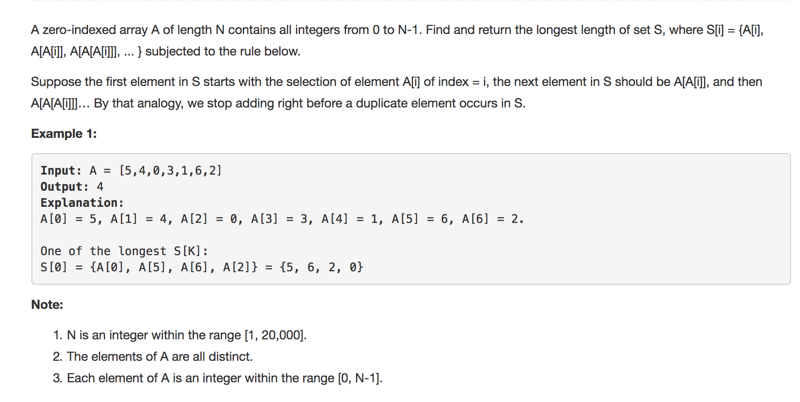

# Array Nesting



## Idea:

给数组A，len = n, A\[i\]在0 - N-1间 求最长数组S\[i\] = {A\[i\], A\[A\[i\]\],...} Note：只能把A\[i\]加到一个S\[i\]中，所以用boolean\[\] visited标记A\[i\]是否加入过一次 This is actually a DFS. Use a visited map to keep track of visited node. If a number is visited before, then the set that starts at this number must be smaller then previous max. So we can safely skip this number. In total it's O\(n\) complexity.

## Code:

```text
public int arrayNesting(int[] nums) {
        int n = nums.length;
        int max = Integer.MIN_VALUE;
        //visited map
        boolean[] visited = new boolean[n];

        for(int i = 0; i < n; i++) {
            if(visited[i]) continue;
            max = Math.max(max, calLen(nums, i, visited));
        }
        return max;
    }

    private int calLen(int[] nums, int start, boolean[] visited) {
        int i = start, count = 0;
        while(count == 0 || i != start) {
            visited[i] = true;
            i = nums[i];
            count++;
        }
        return count;
    }
```

