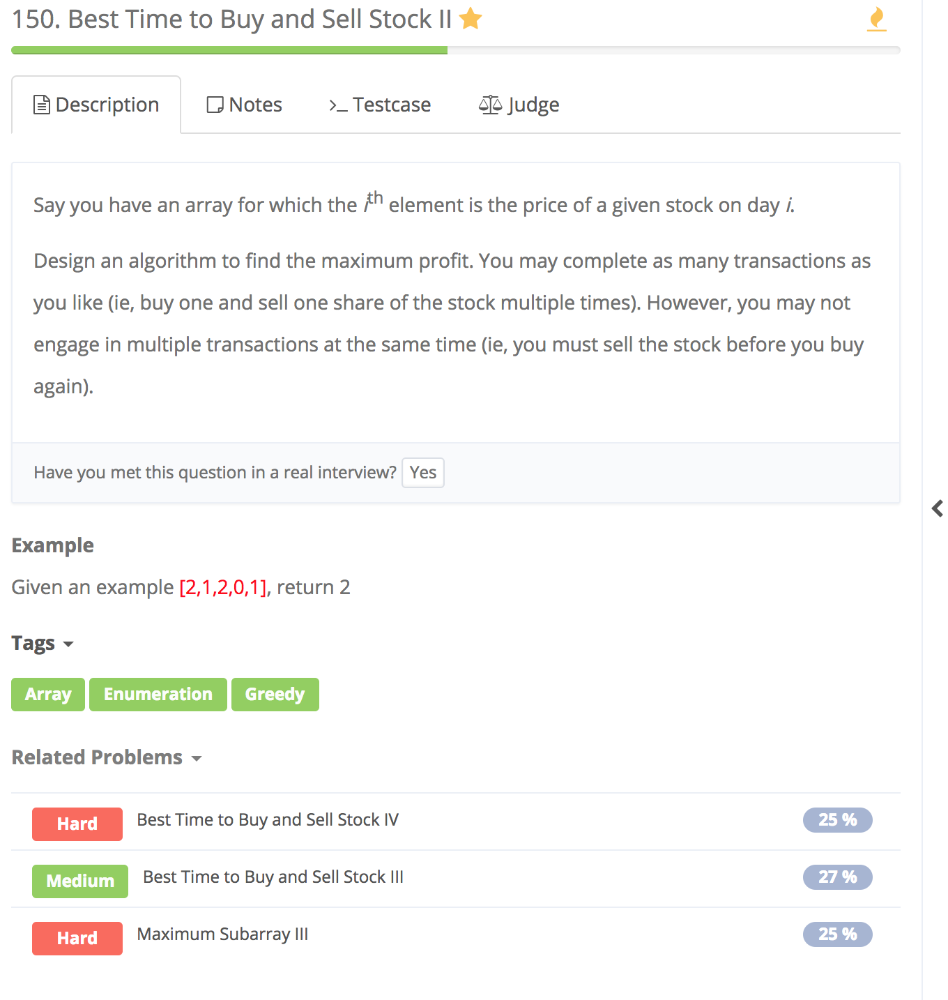

# Best Time to Buy and Sell Stock II



## Idea:

greedy 降价就买，升价就卖

## Error

```text
for(int i = 0; i < prices.length; i++) 
input: [1]
error: Exception in thread "main" java.lang.ArrayIndexOutOfBoundsException: 1

改正：for loop 中i < prices.length - 1
```

## Code

```text
class Solution {
    public int maxProfit(int[] prices) {
        int profit = 0;
        for(int i = 0; i < prices.length-1; i++) {  
            if(prices[i+1] > prices[i]) {
                //then sell it
                profit += prices[i+1] - prices[i];
            }
        }
        return profit;
    }
}
```

