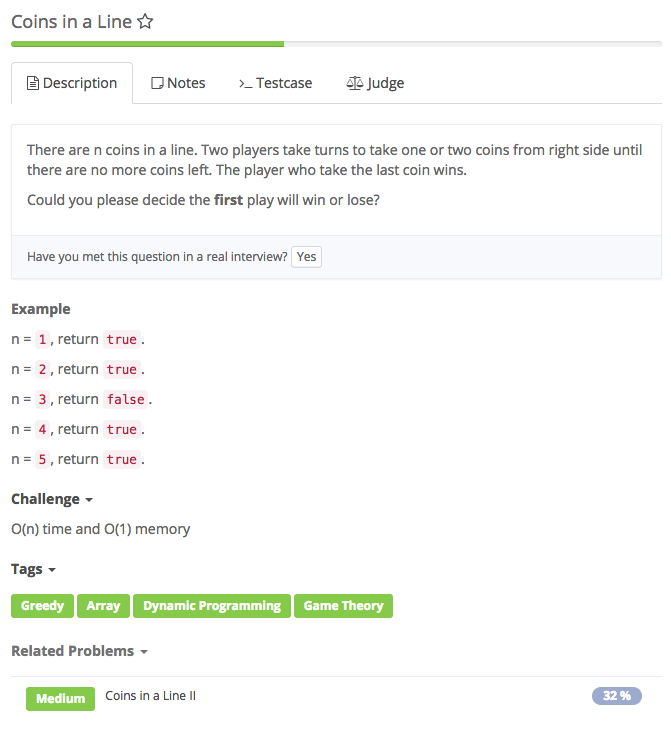

# coins in a line



## Analysis

### Idea:

DP记忆化搜索 1. 这一个问题可以归类到博弈类问题，需要注意的是博弈有先后手。 State: 定义一个人的状态: dp\[i\], 现在还剩i个硬币，现在当前取硬币的人最后输赢状况 Function: 考虑两个人的状态做状态更新: dp\[i\] = \(!dp\[i-1\]\) \|\| \(!dp\[i-2\]\) Intialize: dp\[0\] = false dp\[1\] = true dp\[2\] = true Answer: dp\[n\] 先思考最小状态 然后思考大的状态 -&gt; 往小的递推，那么非常适合记忆化搜索 2. n % 3

```text

```

### reference:

1. [coins](https://aaronice.gitbooks.io/lintcode/content/dynamic_programming/coins_in_a_line.html)

