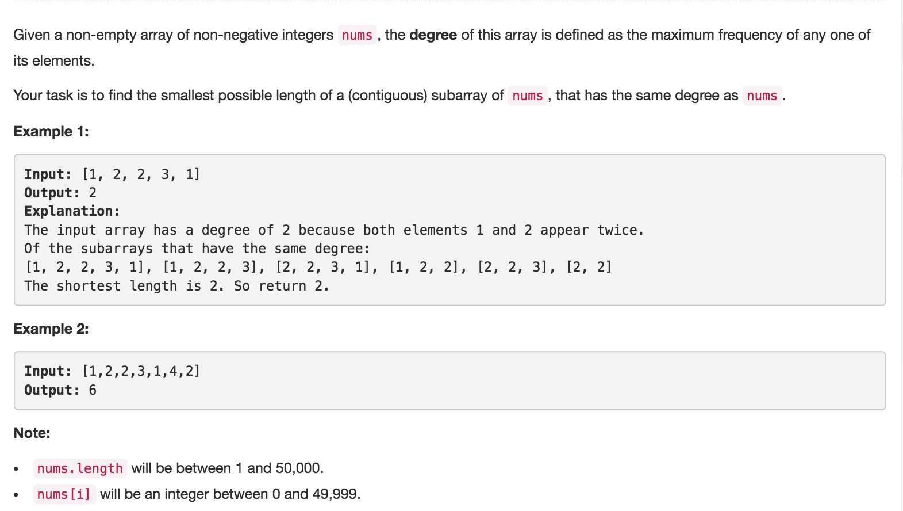

# Degree of an Array



## Idea

1. 找出degree = maximum frequency

   怎么着重复最多的ele - HashMap1

2. 找出包含出现次数最多的（degree）最短subarray

   重复最多的ele第一次出现的index和最后出现index - HashMap2, 最后出现是i

## Code

```text
public int findShortestSubArray(int[] nums) {
        Map<Integer, Integer> freq = new HashMap<>(), firstMet = new HashMap<>();
        int minLen = 0;
        // traverse nums to update the frequency of each element. Add the first occurent of each ele to firstMet
        for(int i = 0, degree = 0; i < nums.length; i++) {
            int f = freq.getOrDefault(nums[i], 0) + 1;
            freq.put(nums[i], f);
            // if nums[i] is the first, add it to firstMet
            if(!firstMet.containsKey(nums[i])) {
                firstMet.put(nums[i], i);
            }
            // update the degree
            if(f > degree) {
                // minLen should be the length of this number
                minLen = i - firstMet.get(nums[i]) + 1;
                degree = f;
            } 
            // or update the minLen
            else if (f == degree) {
                minLen = Math.min(minLen, i - firstMet.get(nums[i]) + 1);
            }
        }
        return minLen;
    }
```

