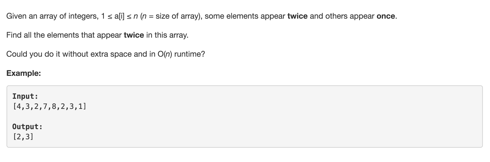

# Find All Duplicates in Array



## Idea:

the integers, 1 &lt;= a\[i\] &lt;= n\(n = size of nums\) --各居其位 find all ele appear twice -- 不替换，用nums\[index\] = -nums\[index\]标记

## Code:

```text
public List<Integer> findDuplicates(int[] nums) {
        List<Integer> res = new ArrayList<>();

        for (int i = 0; i < nums.length;i++) {
            int index = Math.abs(nums[i]) - 1;
            if(nums[index] < 0) {
                res.add(index+1);
            }
            nums[index] = -nums[index];
        }
        return res;
    }
```

