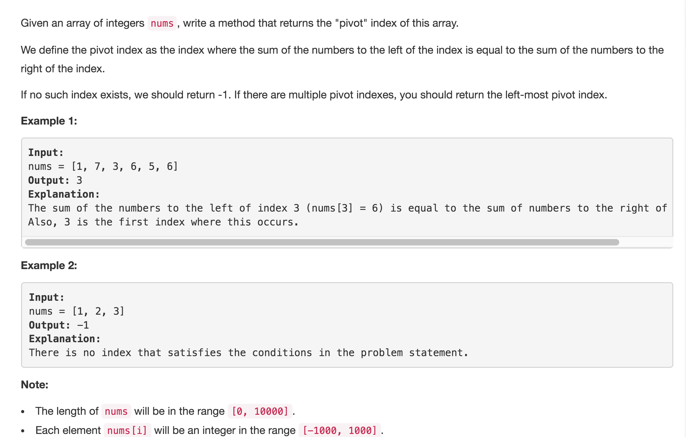

# Find Pivot Index



## Idea

1.multiple pivot, choose leftmost 所以从nums\[0\]开始找 先把所有ele相加，然后试着从nums\[0\]作为pivot用减法来判断两边是否相等

## Code:

```text
public int pivotIndex(int[] nums) {
        //cc
        if(nums == null || nums.length == 0) {
            return -1;
        }
        int sum = 0, left = 0;
        for(int num : nums) {
            sum += num;
        }

        for(int i = 0; i < nums.length; i++) {
            if(i != 0)left += nums[i-1];
            if(sum - left - nums[i] == left) return i;
        }
        return -1;
    }
```

## Error

1. 
```text
for(int i = 1; i < nums.length; i++) {
    left += nums[i-1];

Input: [-1,-1,-1,0,1,1]
Output: -1
Expected: 0

改：for (int i = 0; i < nums.length; i++) {
        if (i != 0) left += nums[i - 1];
因为要考虑nums[0]也可以做pivot
```

