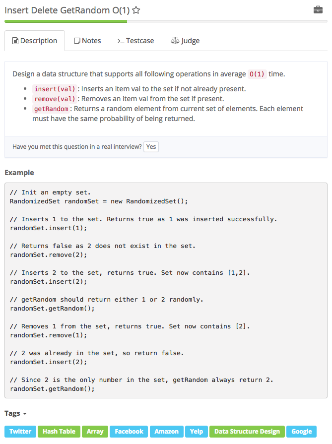

# insert delete getRandom O\(1\)



```text
    /**
     * 本参考程序来自九章算法，由 @九章算法 提供。版权所有，转发请注明出处。
     * - 九章算法致力于帮助更多中国人找到好的工作，教师团队均来自硅谷和国内的一线大公司在职工程师。
     * - 现有的面试培训课程包括：九章算法班，系统设计班，算法强化班，Java入门与基础算法班，Android 项目实战班，Big Data 项目实战班，
     * - 更多详情请见官方网站：http://www.jiuzhang.com/?source=code
     */ 

import java.util.Random;
public class RandomizedSet {

    ArrayList<Integer> nums;
    HashMap<Integer, Integer> m;
    Random rand;

    public RandomizedSet() {
        // do initialize if necessary 
        nums = new ArrayList<Integer>();
        m = new HashMap<Integer, Integer>();  
        rand = new Random();
    }

    // Inserts a value to the set
    // Returns true if the set did not already contain the specified element or false
    public boolean insert(int val) {
        // Write your code here
        boolean contain = m.containsKey(val);
        if ( contain ) return false;
        m.put( val, nums.size());
        nums.add(val);
        return true;
    }

    // Removes a value from the set
    // Return true if the set contained the specified element or false
    public boolean remove(int val) {
        // Write your code here
        boolean contain = m.containsKey(val);
        if ( ! contain ) return false;
        int loc = m.get(val);
        if (loc < nums.size() - 1 ) { // not the last one than swap the last one with this val
            int lastone = nums.get(nums.size() - 1 );
            nums.set( loc , lastone );
            m.put(lastone, loc);
        }
        m.remove(val);
        nums.remove(nums.size() - 1);
        return true;
    }

    // Get a random element from the set
    public int getRandom() {
        // Write your code here
        return nums.get(rand.nextInt(nums.size()));
    }
}

/**
 * Your RandomizedSet object will be instantiated and called as such:
 * RandomizedSet obj = new RandomizedSet();
 * boolean param = obj.insert(val);
 * boolean param = obj.remove(val);
 * int param = obj.getRandom();
 */
```

## 知识点：

HashMap m 1. m.containsKey\(val\) 2. m.put\(key, value\) 3. m.get\(key\) = 返回相对应的value ArrayList nums 1. nums.add\(val\) 2. nums.set\(\) 3. nums.remove\(nums.size\(\) - 1\) 4. nums.size\(\) 5. nums.get\(index?\)

