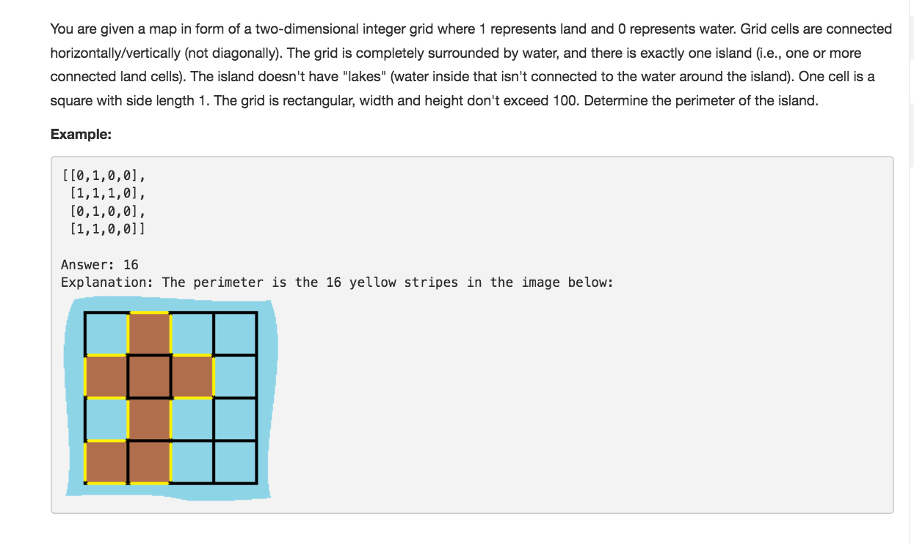

# Island Perimeter



## Idea

找规律的题 观察到只要用island和neighbour的个数求perimeter = islands \* 4 - neighbours \* 2

## Code

```text
public int islandPerimeter(int[][] grid) {
        int islands = 0, neighbours = 0;

        for (int i = 0; i < grid.length; i++) {
            for (int j = 0; j < grid[i].length; j++) {
                if (grid[i][j] == 1) {
                    islands++; // count islands
                    if (i < grid.length - 1 && grid[i + 1][j] == 1) neighbours++; // count down neighbours
                    if (j < grid[i].length - 1 && grid[i][j + 1] == 1) neighbours++; // count right neighbours
                }
            }
        }

        return islands * 4 - neighbours * 2;
    }
```

