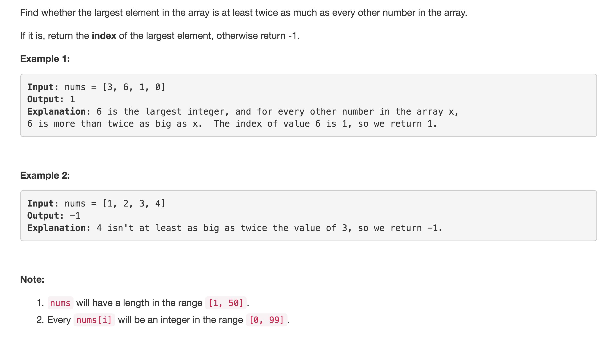

# Largest Number At Least Twice of Others



## Idea：

1. traverse nums找最大和第二大，如果最大是第二大的两倍，return最大的index

注意：

```text
nums = [1]，返回0，所以init index = 0
init max = nums[0], secondMax = -1;
```

## Code:

```text
public int dominantIndex(int[] nums) {
        int max = nums[0], secondMax = -1, index = 0; //当nums = [1]时，要返回0，所有init index = 0

        //traverse to find max, secondMax
        for(int i = 1; i < nums.length; i++) {
            if(nums[i] > max) {
                secondMax = max;
                max = nums[i]; 
                index = i;
            } else if(nums[i] > secondMax) {
                secondMax = nums[i];
            }
        }

        // compare secondMax with max
       return max >= secondMax * 2 ? index : -1;
    }
```

