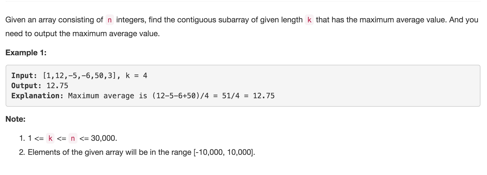

# \*Maximum Average Subarray I



## Idea:

subarray length = k, 从0开始sliding window, 记录max

## Code:

```text
 public double findMaxAverage(int[] nums, int k) {
        long sum = 0; //why long
        // init a window
        for(int i = 0; i < k; i++) { 
            sum += nums[i]; 
        }
        long max = sum;
        //sliding
        for(int i = k; i < nums.length; i++) {
            sum += nums[i] - nums[i-k];
            max = Math.max(max, sum);
        }
        return max/1.0/k; // /1.0 get 12.75, not 12.0
    }
```

