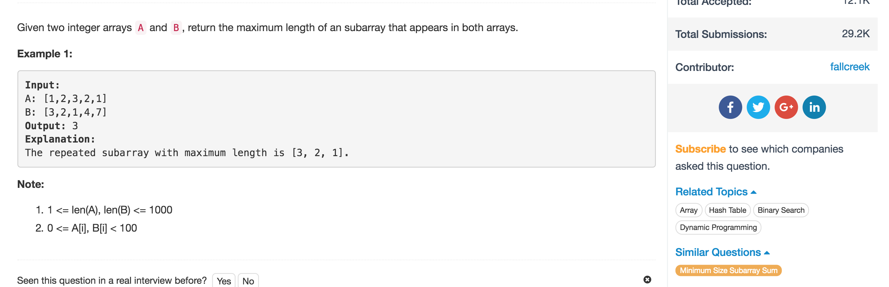

# Maximum Length of Repeated Subarray



## Idea

## Code

```text
class Solution {
    public int findLength(int[] A, int[] B) {
        //CC
        if(A == null || B == null) return 0;
        int m = A.length;
        int n = B.length;
        int max = 0;

        //dp[i][j] is the length of longest common subarray ending with nums[i-1] and nums[j-1]
        int[][] dp = new int[m+1][n+1];
        for(int i = 0; i <= m; i++) {
            for(int j = 0; j <= n; j++) {
                //设边界
                if(i == 0 || j == 0) {
                    dp[i][j] = 0;
                } else {
                    if(A[i-1] == B[j-1]) { //*
                        //状态转移方程式
                        dp[i][j] = dp[i-1][j-1] + 1;
                        max = Math.max(max, dp[i][j]);
                    }
                }
            }
        }
        return max;
    }
}
```

