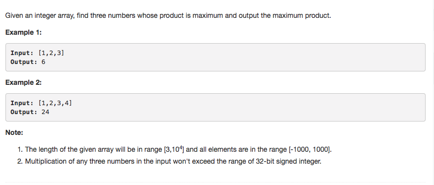

# Maximum Product of Three Numbers



## Idea

1. 找三个数使得乘积最大

   正：max1, max2, max3 负：min1, min2, max3

2. 分两部分，分别找出max1 &gt; max2 &gt; max3, 和min1 &lt; min2 &lt; 0
3. Initialize 这5个var, 判断当前ele的大小，把它赋给它应属于的var

## Code

```text
public int maximumProduct(int[] nums) {
        int max1 = Integer.MIN_VALUE, max2 = Integer.MIN_VALUE, max3 = Integer.MIN_VALUE, min1 = Integer.MAX_VALUE, min2 = Integer.MAX_VALUE;
        for (int n : nums) {
            // max1 > max2 > max3
            if(n > max1) {
                max3 = max2;
                max2 = max1;
                max1 = n;
            } else if (n > max2) {
                max3 = max2;
                max2 = n;
            } else if (n > max3) {
                max3 = n;
            }

            // min1 < min2
            if(n < min1) {
                min2 = min1;
                min1 = n;
            } else if (n < min2) {
                min2 = n;
            }
        }
        return Math.max(max1*max2*max3, min1*min2*max1);
    }
```

