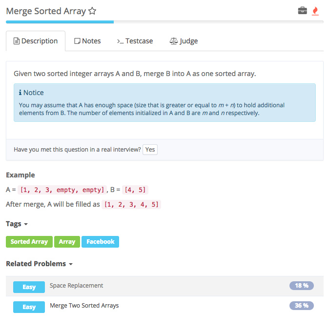
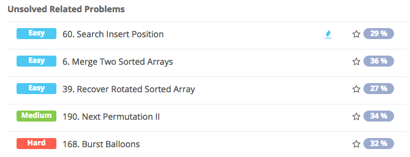

# merge sorted array



## Analysis

### Idea:

1. 既然A数组空间够大，那就申请两指针，分别指向A和B有序数组的尾部，第三个指针index指向最后一个能被替换的位置 m + n -1, 从后向前，比较大小，若A\[i\] &gt; B\[j\]就意味着A\[i\]是所有数最大故直接放到A的最后即index所在的位置。若A\[i\] &lt;= B\[j\]就意味着B\[j\]是最大的直接放到A的最后。
2. 两个while的判断，以便在其中一个数组全部放完后，可以把另一个数组中剩余的放到A中

```text
class Solution {
    /**
     * @param A: sorted integer array A which has m elements, 
     *           but size of A is m+n
     * @param B: sorted integer array B which has n elements
     * @return: void
     */
    public void mergeSortedArray(int[] A, int m, int[] B, int n) {
        // write your code here
        int i = m - 1, j = n - 1, index = m + n - 1;
        while (i >= 0 && j >= 0) { //*
            if (A[i] > B[j]) {
                A[index--] = A[i--];
            } else {
                A[index--] = B[j--];
            }
        }
        while (i >= 0) {
            A[index--] = A[i--];
        }
        while (j >= 0) {
            A[index--] = B[j--];
        }
    }
}
```



