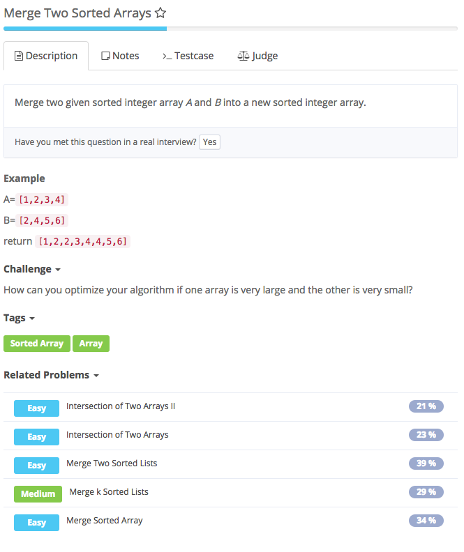
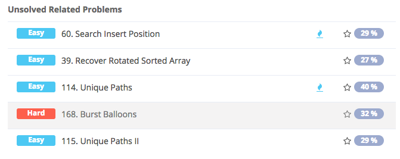

# merge two sorted Array



## Analysis

### Idea:

与merge sorted array 相似

```text
public class Solution {
    /*
     * @param A: sorted integer array A
     * @param B: sorted integer array B
     * @return: A new sorted integer array
     */
    public int[] mergeSortedArray(int[] A, int[] B) {
        // write your code here
        if (A == null || B == null) {
            return null;
        }
        int[] result = new int[A.length + B.length];
        int i = 0, j = 0, index = 0;
        while (i < A.length && j < B.length) {
            if (A[i] < B[j]){
                result[index++] = A[i++];
            } else {
                result[index++] = B[j++];
            }
        }
        while (i < A.length) {
            result[index++] = A[i++];
        }
        while (j < B.length) {
            result[index++] = B[j++];
        }
        return result;
    }
}
```



