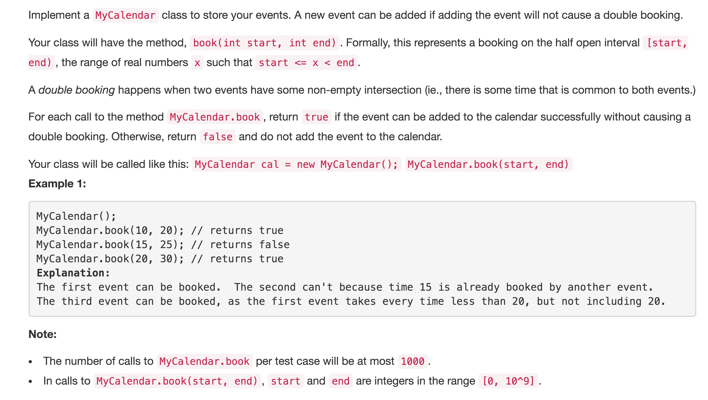

# My Calender



## Idea

floorKey: TreeMap中比start小的最大的key ceilingKey: TreeMap中比start大的最小的key

不能添加\[start, end\]period的情况 1. floorKey的value即end1 &gt; start 2. ceilingKey &lt; end

## Code

```text
class MyCalendar {
    TreeMap<Integer, Integer> map; //declare
    public MyCalendar() {
        map = new TreeMap<>();    //Initialize
    }

    public boolean book(int start, int end) {
        //end > pre.start
        Integer floorKey = map.floorKey(start);
        if(floorKey != null && map.get(floorKey) > start) return false;
        Integer ceilingKey = map.ceilingKey(start);
        if(ceilingKey != null && ceilingKey < end) return false;

        map.put(start, end);
        return true;
    }
}

/**
 * Your MyCalendar object will be instantiated and called as such:
 * MyCalendar obj = new MyCalendar();
 * boolean param_1 = obj.book(start,end);
 */
```

## Syntax

```text
TreeMap
1. constructor: TreeMap<Integer, Integer> map = new TreeMap<>();

2. map.floorKey(cKey): return the greatest key that less than cKey

3. map.ceilingKey(cKey): return the smallest key that larger than cKey
```

