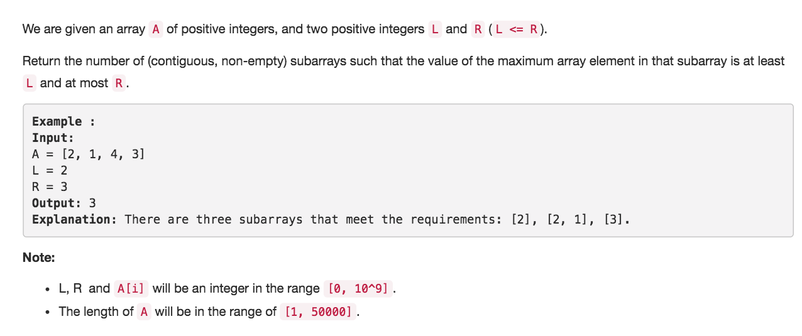

# Number of Subarray with Bounded Maximum

## 

## Idea

计算subarray个数 = 1 + ... + n  
A\[i\] 三种情况:

1. L &lt;= A\[i\] &lt;= R

    j记录在i之前所有in Range的第一个ele的index

    所以当前in Range的所有ele为count = i-j+1

    i,j之间所有的subarray = i-j+1. res += i-j+1

2. A\[i\] &lt; L 若A\[i\]小于L，能包含它且符合条件的subarray的个数 是i-1的count
3. A\[i\] &gt; R 若A\[i\] &gt; R,直接跳过j= i+1, count = 0

## Code

```text
public int numSubarrayBoundedMax(int[] A, int L, int R) {
        // count how many ele is in range [L,R]
        // ele with index in range [i,j] are <= L and >= R
        int j = 0, count = 0, res = 0;

        //subarray end with A[i]
        for(int i = 0; i < A.length; i++) {
            if(L <= A[i]  && A[i] <= R) {
                res += i-j+1;
                count = i-j+1;
            } 
            // 
            else if(A[i] < L) {
                res += count;
            } 

            else {
                j = i+1;
                count = 0;
            }
        }
        return res;
    }
```

