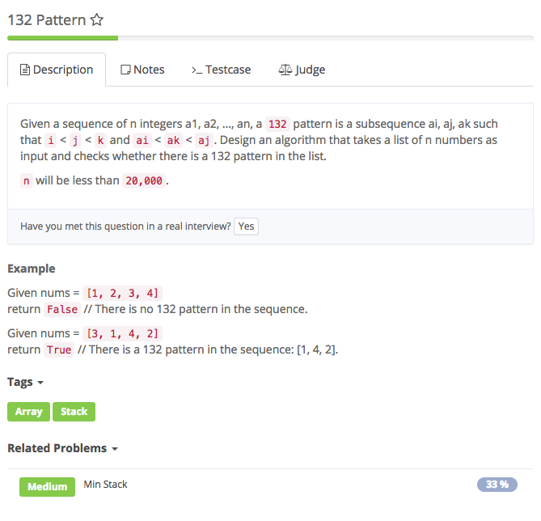

# @pattern

## Analysis

### Idea:

The idea is that we can use a stack to keep track of previous min-max intervals.

Here is the principle to maintain the stack:

For each number num in the array

If stack is empty:

push a new Pair of num into stack If stack is not empty:

if num &lt; stack.peek\(\).min, push a new Pair of num into stack

if num &gt;= stack.peek\(\).min, we first pop\(\) out the peek element, denoted as last

if num &lt; last.max, we are done, return true;

if num &gt;= last.max, we merge num into last, which means last.max = num. Once we update last, if stack is empty, we just push back last. However, the crucial part is: If stack is not empty, the updated last might:

Entirely covered stack.peek\(\), i.e. last.min &lt; stack.peek\(\).min \(which is always true\) && last.max &gt;= stack.peek\(\).max, in which case we keep popping out stack.peek\(\). Form a 1-3-2 pattern, we are done ,return true So at any time in the stack, non-overlapping Pairs are formed in descending order by their min value, which means the min value of peek element in the stack is always the min value globally.

