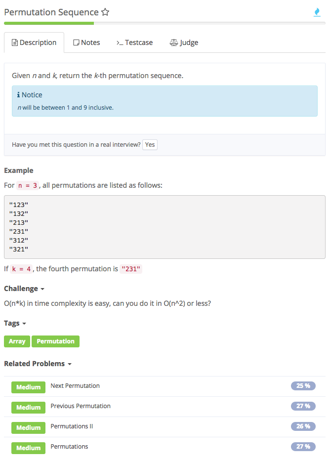
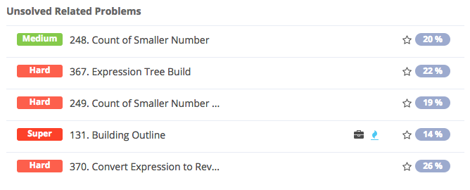

# permutation sequence

## Reference

[参考1](https://github.com/dabingcheerup/Notebook/tree/947f9c753a2833ca91b7a68cf6f60958538ef3cc/%20https:/zhengyang2015.gitbooks.io/lintcode/permutation_sequence_388.html) [参考2](https://discuss.leetcode.com/topic/17348/explain-like-i-m-five-java-solution-in-o-n/2)

### 知识点：

1. StringBuilder sb.append\(\)
2. String.valueOf\(sb\)

