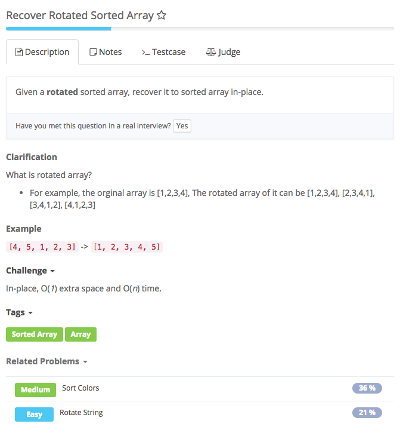
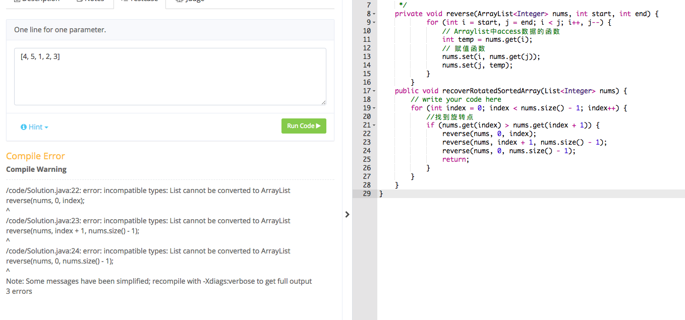
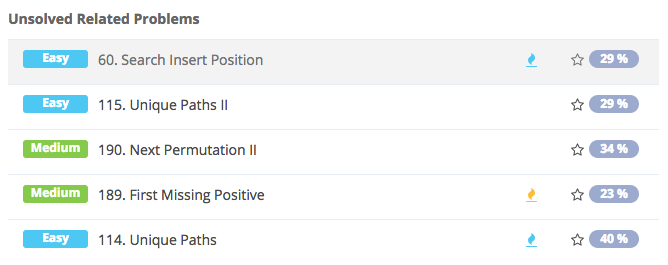

# recover rotated sorted array



## Analysis

### Idea:

与merge two sorted array相似 1. for循环找到第一个数，其值小于下一个数 2. 以这个数为界，前面的数反转，后面的数也反转 3. 最后得到一个降序的数组，再反转一次就成了升序 小技巧：进行三次反转

```text
import java.util.ArrayList;


public class Solution {
    /**
     * @param nums: The rotated sorted array
     * @return: The recovered sorted array
     */
    private void reverse(ArrayList<Integer> nums, int start, int end) {
        for (int i = start, j = end; i < j; i++, j--) {
            int temp = nums.get(i);
            nums.set(i, nums.get(j));
            nums.set(j, temp);
        }
    }

    public void recoverRotatedSortedArray(ArrayList<Integer> nums) {
        for (int index = 0; index < nums.size() - 1; index++) {
            if (nums.get(index) > nums.get(index + 1)) {
                reverse(nums, 0, index);
                reverse(nums, index + 1, nums.size() - 1);
                reverse(nums, 0, nums.size() - 1);
                return;
            }
        }
    }
}
```

### 错误点：

 题目用了List

### 知识点：

1. ArrayList\(\) 访问数据 nums.get\(index\) 赋值 nums.set\(index, or varName or nums.get\(index\)\) 求长度 nums.size\(\)

   

