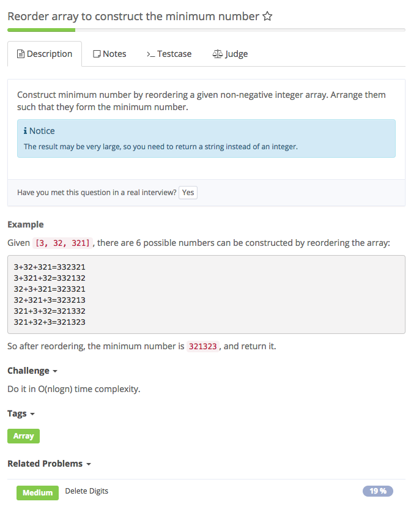
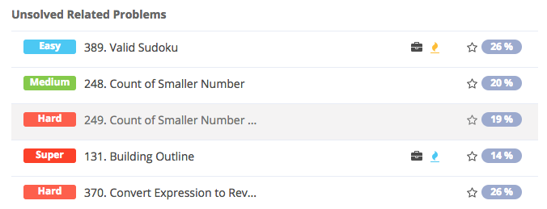

# reorder array to construct the minimum number

## Analysis

### Idea：

与largest number 相似 见参考3

### Reference

[参考1](http://blog.csdn.net/qwe6112071/article/details/71699999) [参考2](http://blog.csdn.net/haifischxia/article/details/52275660)

[参考3](http://blog.csdn.net/ljiabin/article/details/42676433)

### 知识点：

1.comparator [1\)](http://www.cnblogs.com/skywang12345/p/3324788.html) [ 2\)](http://www.cnblogs.com/z2002m/archive/2011/10/24/2222780.html) [3\)](http://www.jb51.net/article/66318.htm) 2. Array.sort\(\)的几种用法 包括comparator [1\)](http://youyu4.iteye.com/blog/2290210) 

