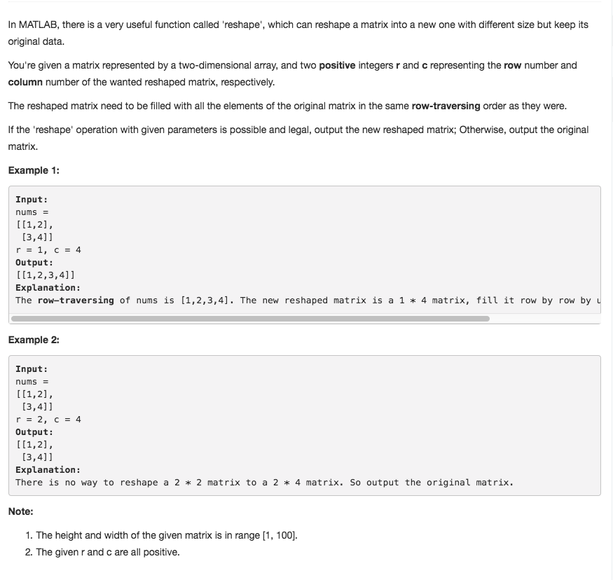

# Reshape the Matrix



## Idea

1. 判断是否可以reshape

   n = nums.length, m = nums\[0\].length if \(n_m != r_c\), return nums

2. 把nums中的ele逐个放进reshape中

   **利用 i/c是row i%c是col**

## Code

```text
public int[][] matrixReshape(int[][] nums, int r, int c) {
        int n = nums.length, m = nums[0].length;

        // determine if the original can be reshaped
        if((n * m) != (r*c)) {
            return nums;
        }
        int[][] reshape = new int[r][c];

        for (int i = 0; i < r*c; i++) {
            reshape[i/c][i%c] = nums[i/m][i%m];
        }
        return reshape;
    }
```

