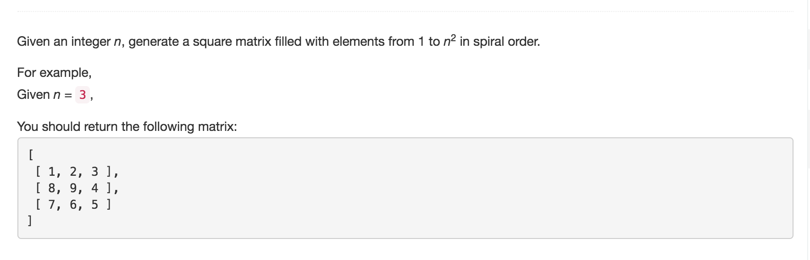

# Spiral Matrix II



## Idea

与spiral matrix 1 一样 注意判断n == 0情况

## Code

```text
  public int[][] generateMatrix(int n) {
        int[][] matrix = new int[n][n];

        if(n == 0) {
            return matrix;
        }
        int rowBegin = 0;
        int rowEnd = n-1;
        int colBegin = 0;
        int colEnd = n-1;
        int num = 1;

        while(rowBegin <= rowEnd && colBegin <= colEnd) {
            // traverse right
            for(int j = colBegin; j <= colEnd; j++) {
                matrix[rowBegin][j] = num++;
            }
            rowBegin++;

            // down
            for(int i = rowBegin; i <= rowEnd; i++) {
                matrix[i][colEnd] = num++;
            }
            colEnd--;

            // left
            for(int j = colEnd; j >= colBegin; j--) {
                if(rowBegin <= rowEnd) {
                    matrix[rowEnd][j] = num++;
                }
            }
            rowEnd--;

            //down
            for(int i = rowEnd; i >= rowBegin; i--) {
                if(colBegin <= colEnd) {
                    matrix[i][colBegin] = num++;
                }
            }
            colBegin++;
        }
        return matrix;
    }
}
```

