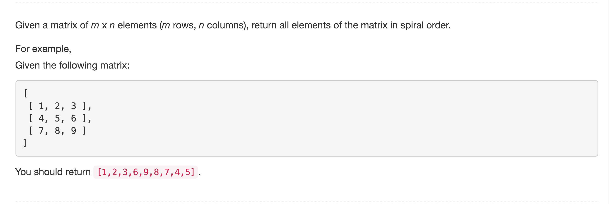

# Spiral Matrix



## Code

```text
 public List<Integer> spiralOrder(int[][] matrix) {
        List<Integer> res = new ArrayList<Integer>();

        if(matrix.length == 0) {
            return res;
        }

        int rowBegin = 0;
        int rowEnd = matrix.length-1;
        int colBegin = 0;
        int colEnd = matrix[0].length-1;

        while(rowBegin <= rowEnd && colBegin <= colEnd) {
            // traverse right
            for (int j = colBegin; j <= colEnd; j++) {
                res.add(matrix[rowBegin][j]);
            }
            rowBegin++;
            // traverse down
            for(int i = rowBegin; i <= rowEnd; i++) {
                res.add(matrix[i][colEnd]);
            }
            colEnd--;

            if (rowBegin <= rowEnd){
                // traverse left
                for(int j = colEnd; j >= colBegin; j--) {
                    res.add(matrix[rowEnd][j]);
                }
            }
            rowEnd--;
            if(colBegin <= colEnd) {
                // traverse up
                for(int i = rowEnd; i >= rowBegin; i--) {
                    res.add(matrix[i][colBegin]);
                }
            }
            colBegin++;
        }
        return res;
    }
```

