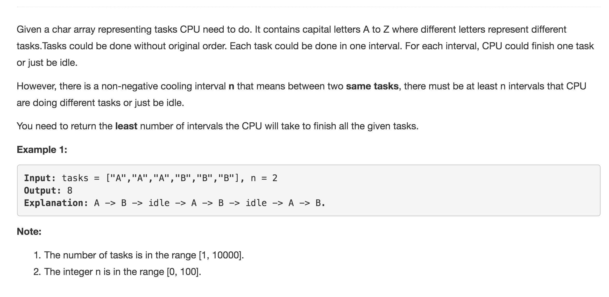

# Task Scheduler



## Ref

\[concise Java Solution O\(N\) time O\(26\) space\]\([https://leetcode.com/problems/task-scheduler/discuss/104496/concise-Java-Solution-O\(N\)-time-O\(26\)-space](https://leetcode.com/problems/task-scheduler/discuss/104496/concise-Java-Solution-O%28N%29-time-O%2826%29-space)\)

## Code

```text
public int leastInterval(char[] tasks, int n) {
        int len = tasks.length;
        //记录每种tasks有几个
        int[] count = new int[26];
        //最多的task的个数max，maxNum个tasks的个数都是max
        int max = 0, maxNum = 0;
        //traverse找出maxNum个tasks的个数是max
        for(char c : tasks) {
            count[c - 'A']++;
            if(count[c - 'A'] > max) {
                max = count[c - 'A'];
                maxNum = 1;
            } else if (count[c - 'A'] == max) {
                maxNum++;
            }
        }
        return Math.max(len, (max - 1) * (n + 1) + maxNum);

    }
```

