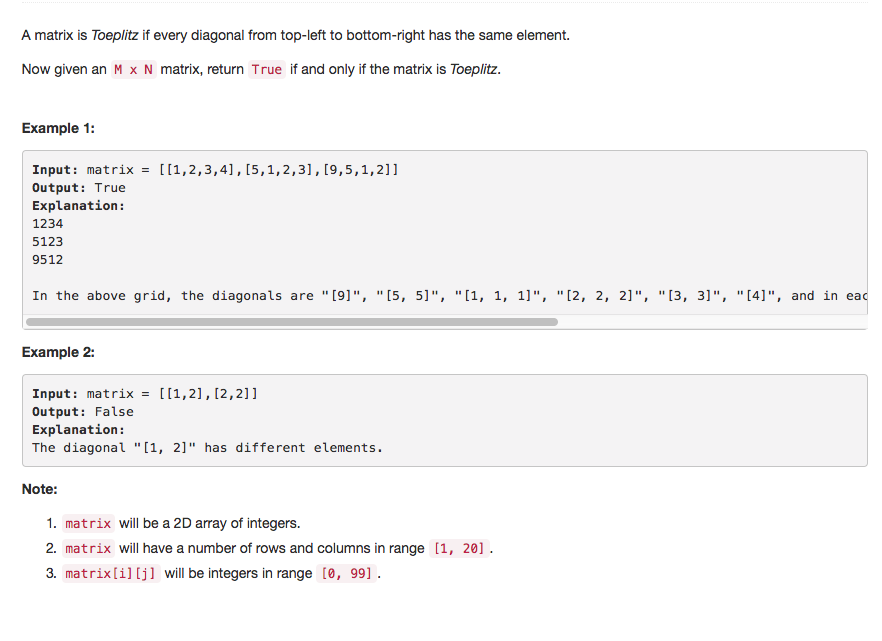

# Toeplitz Matrix



## Idea

1. matrix\[i\]\[j\] 和 matrix\[i+1\]\[j+1\] 比较， 不一样return false

   Note: index boundry

## Code

```text
public boolean isToeplitzMatrix(int[][] matrix) {
        for (int i = 0; i < matrix.length - 1; i++) {
            for(int j = 0; j < matrix[i].length - 1; j++) {
                if(matrix[i][j] != matrix[i + 1][j + 1]) return false;
            }
        }
        return true;
    }
```

