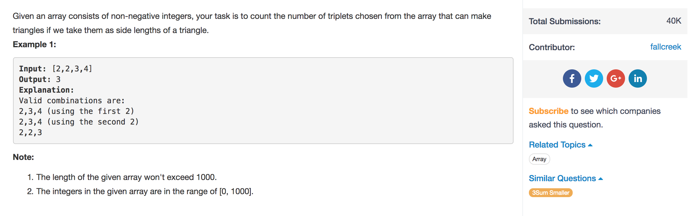

# Valid Triangle Number



## Idea

Valid Triangle: a &gt; b &gt; c, b+c &gt; a

```text
1. sort nums
2. for loop i, right = i-1, left = 0; 
    if left + right > i
        count += right - left;
        right--;
    else 
        left++;
```

## Code

```text
class Solution {
    public int triangleNumber(int[] nums) {
        Arrays.sort(nums);
        int count = 0, n = nums.length;
        for(int i = n-1; i >= 2; i--) {
            int left = 0, right = i-1;
            while(left < right) {
                if(nums[left] + nums[right] > nums[i]) {
                    count += right - left; // 
                    right--;
                } else {
                    left++;
                }
            }
        }
        return count;
    }
}
```

