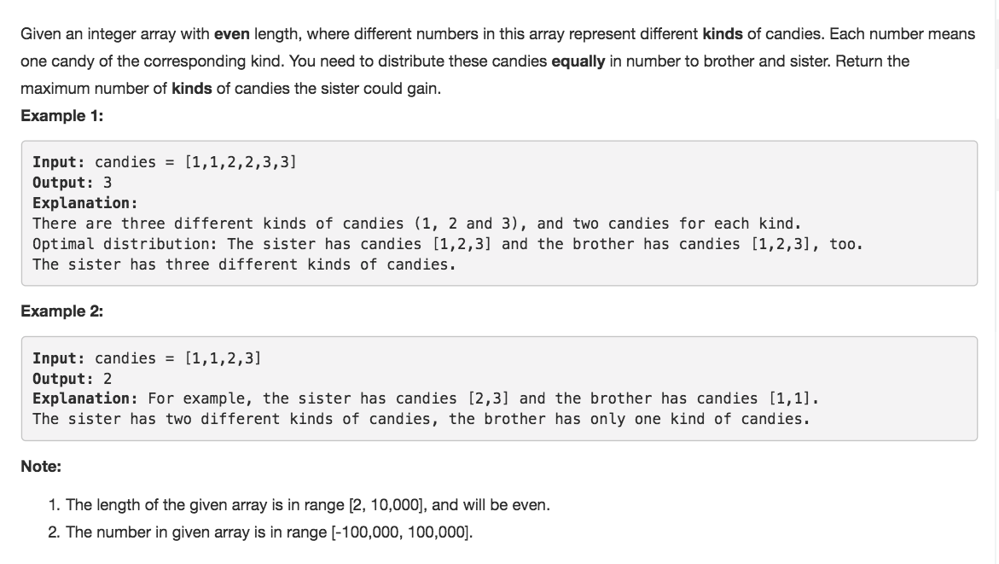

# Distribute Candies



## Idea

HashSet找出candies的种类

## Code

```text
 public int distributeCandies(int[] candies) {
        int n = candies.length;
        Set<Integer> distinct = new HashSet<>();
        for(int c : candies) distinct.add(c);
        return distinct.size() >= n/2 ? n/2 : distinct.size();
    }
```

