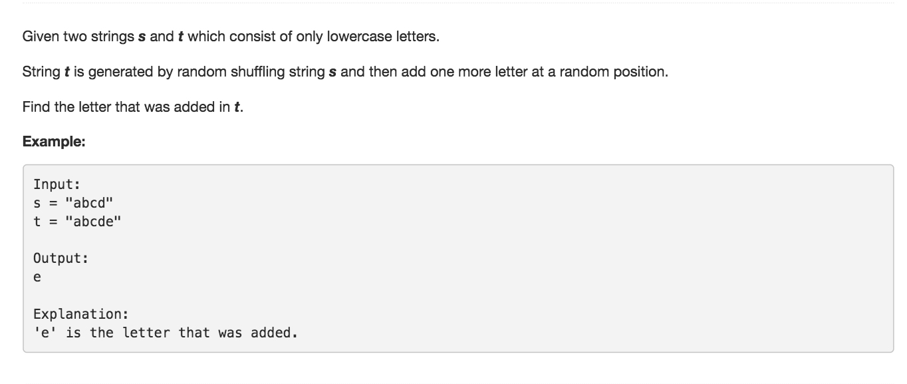

# Find the Difference



## Idea

对对碰

## Error

```text
// Use HashSet
public char findTheDifference(String s, String t) {
        Set set = new HashSet();
        Character res = null;
        for(char c : s.toCharArray()) {
            set.add(c);
        }

        for(char c : t.toCharArray()) {
            if(!set.contains(c)) {
                return c;
            }
        }
        return res;
    }

Input: "a" "aa"
Error: Exception in thread "main" java.lang.NullPointerException
    at Solution.findTheDifference(Solution.java:14)
    at __DriverSolution__.__helper__(__Driver__.java:8)
    at __Driver__.main(__Driver__.java:54)
```

## Code

```text
public char findTheDifference(String s, String t) {
        int[] alphabet = new int[26];
        for(char c : s.toCharArray()) {
            alphabet[c-'a']++;
        }

        for(char c : t.toCharArray()) {
            if(--alphabet[c-'a'] < 0) {
                return c;
            }
        }
        return 0;
    }
```

