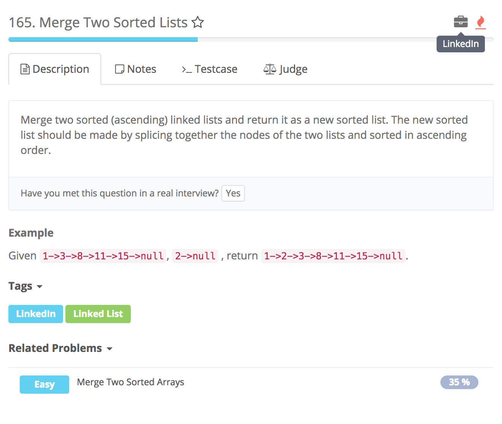

# Merge 2 Sorted LinkedList



## Idea:

1. new一个LinkedList dummy指向表头，lastNode作为表尾
2. while\(l1 != null && l2 != null\)

   从头开始比较两个list当前node的大小

   1. l1.val &lt; l2.val

       把l1放到lastNode尾,l1挪到下一个

       lastNode.next = l1;

       l1 = l1.next

   2. else

       把l2放到lastNode尾,l2挪到下一个

       lastNode.next = l2;

       l2 = l2.next

   3. lastNode = lastNode.next

3. （不用直到l1,l2都为空，这是对LinkedList理解不透）因为跳出循环后，剩下不为空的表头加到表尾lastNode后就可以了，此时整条list都加上了。最后返回dummy.next
   1. l1 != null

      lastNode.next = l1

   2. else

      lastNode.next = l2

   3. return dummy.next

## Error:

```text
ListNode res = new ListNode(0);
ListNode dummy = new ListNode(0);
dummy.next = res;
```

log:

```text
Your input
    null
    0->3->3->null
Your output
    0->0->3->3->null
Expected
    0->3->3->null
```

原因：dummy在指向表头的，所以返回dummy.next作为表头。而再用一个listnode lastNode标记为表的最后一个，init 为dummy，扩充表时通过lastNode.next

改进：

```text
ListNode dummy = new ListNode(0);
ListNode lastNode = dummy;
```

## Code：

```text
public ListNode mergeTwoLists(ListNode l1, ListNode l2) {
        // write your code here
        ListNode dummy = new ListNode(0);
        ListNode lastNode = dummy;

        while(l1 != null && l2 != null){
            if(l1.val < l2.val){ //谁小谁先加入，若大于等于就l2加入
                lastNode.next = l1;
                l1 = l1.next;
            }else{
                lastNode.next = l2;
                l2= l2.next;
            }
            lastNode = lastNode.next;
        }
        //此时不是l1空了就是l2空了，才退出while，所以现在谁不空，谁就是lastNode.next
        if(l1 != null){
            lastNode.next = l1;
        }else{
            lastNode.next = l2;
        }

        return dummy.next;
    }
```

