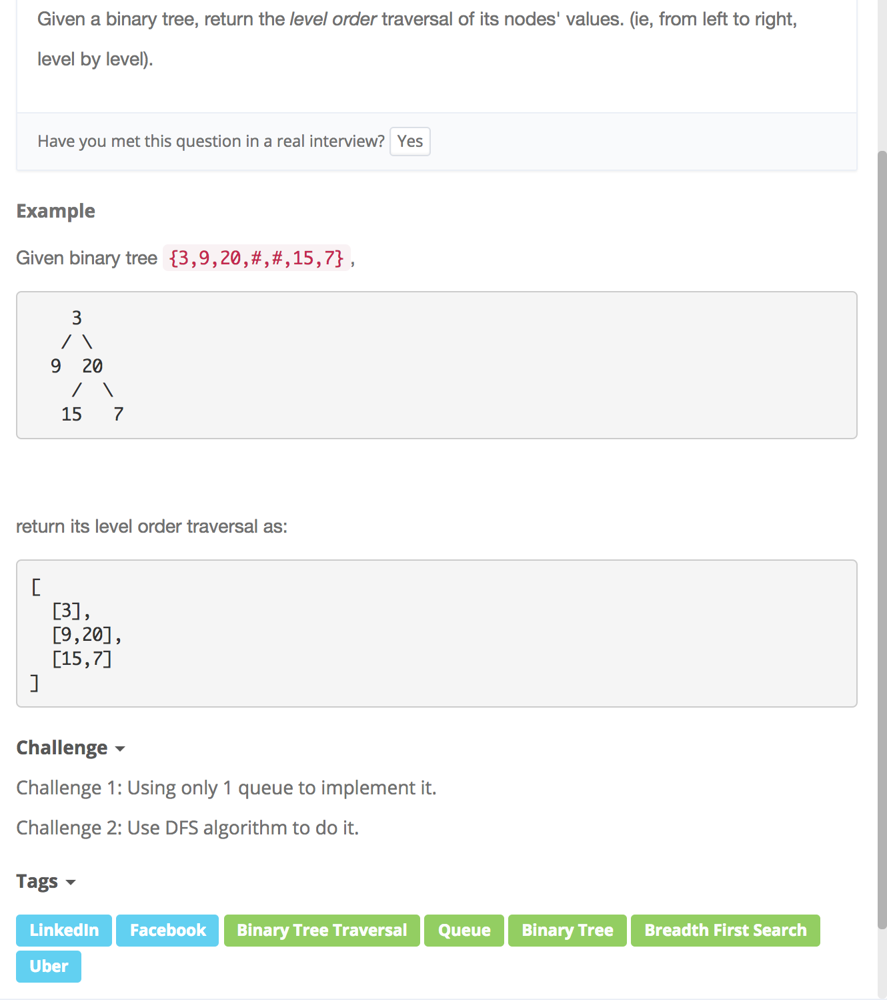

# Binary Tree Level Order Traversal



## Idea

考察二叉树的层序访问 用Queue把当前层的所有node放进去后，用一个count记录个数，然后把Queue中该层的所有node一个个poll出来放进level linkedList中，每poll一个node就把它的左右nodeoffer到Queue尾，等i=count该层所有的node都加到level，for loop结束把level放到结果中。 由于Queue不为空，再把之前塞进队尾的下层都poll出来 1. while（!queue.isEmpty\(\)） 2. CC: 最开始要判断root是否为null 每次放左右子时要判断它们是否为空

## Code

```text
 public List<List<Integer>> levelOrder(TreeNode root) {
        List<List<Integer>> result = new ArrayList<>(); 
        if (root == null) return res;  //*
        Queue<TreeNode> queue = new LinkedList<>(); //*要用LinkedList
        queue.offer(root);
        while(!queue.isEmpty()) {
            List<Integer> level = new ArrayList<>();
            int count = queue.size();
            //pop each level's Node
            for(int i = 0; i < count; i++ ) {
                //get the first one in the queue
                TreeNode node = queue.poll();
                //add the node to its level list
                level.add(node.val); 
                if(node.left != null) {
                    queue.offer(node.left);
                }
                if(node.right != null) {
                    queue.offer(node.right);
                }
            }
            // added all node of the cur level, so add level to res
            result.add(level);
        }
        return result;
    }
```

## Syntax

Queue constructor: Queue&lt;&gt; queue = new Queue&lt;&gt;\(\) 1. queue.offer\(\) 入列 2. queue.poll\(\) 弹出第一个元素 3. queue.peek\(\) 看一眼最顶元素、 4. queue.size\(\) 5. queue.add\(\) [java Queue中 add/offer，element/peek，remove/poll区别](http://blog.csdn.net/u012050154/article/details/60572567) 6. queue.isEmpty\(\)

