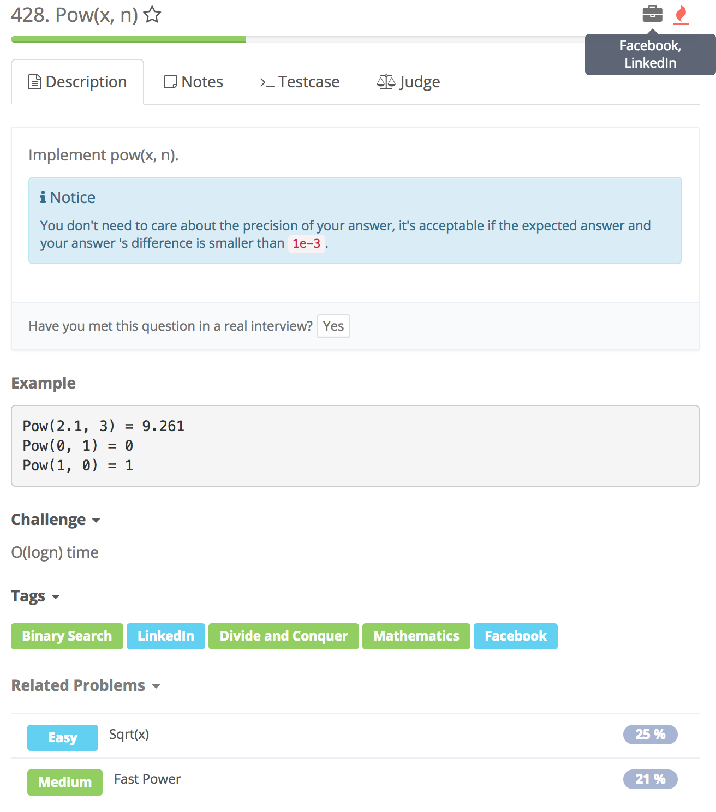

# Pow\(x, n\)



## Idea:

考虑三个方面：

1. n == 0, return 1
2. 要考虑n &lt; 0，那么n = -n; x = 1/x;
3. 根据n的奇偶情况来递归求值
   1. 偶数，则递归myPow\(x\*x, n/2\)
   2. 奇数，则递归x_myPow\(x_x, n/2\)

## Errors

```text
public class Solution {
    public double pow(double x, int n) {
        if(n == 0)
            return 1;
        if(n<0){
            n = -n;
            x = 1/x;
        }
        return (n%2 == 0) ? pow(x*x, n/2) : x*pow(x*x, n/2); //n为奇数时
    }
}

//error
Input: 
    2.00000
    -2147483648
Output:
    ∞
Expected:
    0.0

//Reason
当n 为 Integer.MIN_VALUE(-2147483648) 
那么n = -n 会overflow，因为Integer.MAX_VALUE为2147483647
```

## Code

```text
public class Solution {
    /**
     * @param x the base number
     * @param n the power number
     * @return the result
     */
   public class Solution {
    public double myPow(double x, int n) {
        if(n == 0) return 1.;
        double res = myPow(x, n / 2);
        return n % 2 == 0 ? res * res : n < 0 ? res * res * (1 / x) : res * res * x;
    }
}
```

