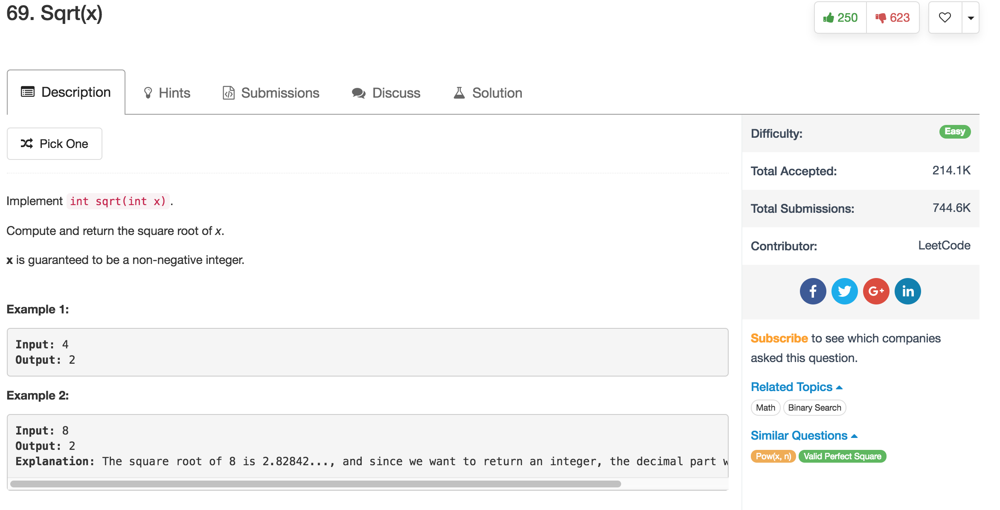

# Sqrt\(x\)



## Idea

1. The sequence 1, 2, ... , n has no duplication.
2. Near the very end, closest step, before while loop, left = mid = right.
3. In while, If mid &lt; sqrt\(x\), left = mid + 1 executed, right pointer is not moving, and right is the answer.
4. If while, If mid &gt; sqrt\(x\), right = mid - 1 executed, right pointer shifts left 1, closest to sqrt\(x\), right is also the answer.

## Code

```text
public int mySqrt(int x) {
        int left = 1, right = x;
        while(left <= right) {
            int mid = left + (right - left)/2;
            if(mid == x/mid){ //正好是根
                return mid;
            } else if(mid > x/mid) {
                right = mid - 1; //因为不可能是mid，得比mid小所以是mid-1
            } else {
                left = mid + 1;
            }
        }
        //没有找到根，返回最接近的right
        return right;
    }
```

